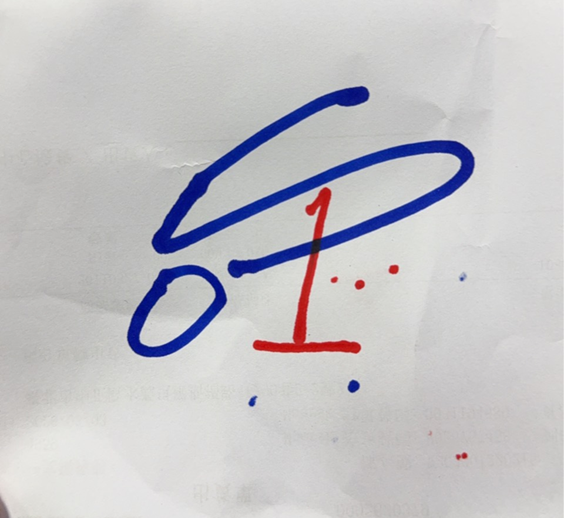
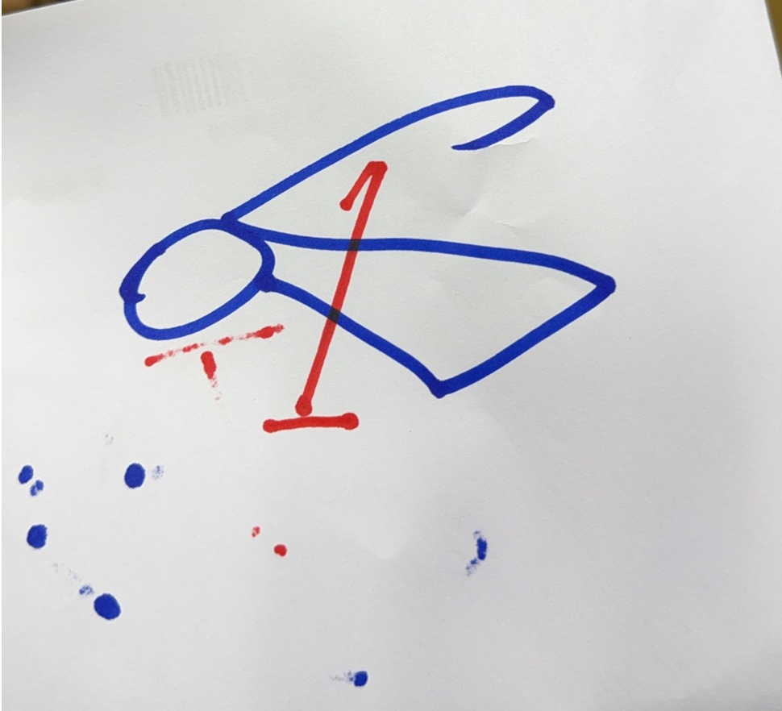
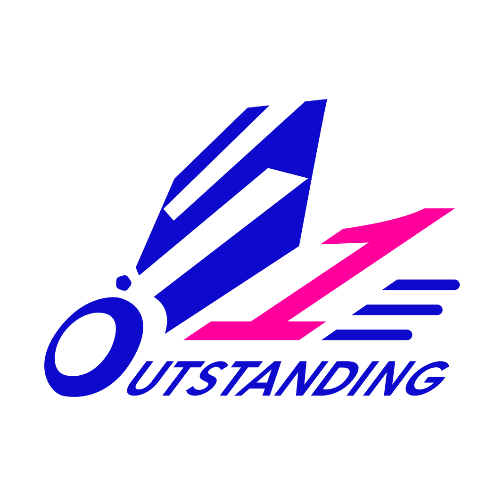
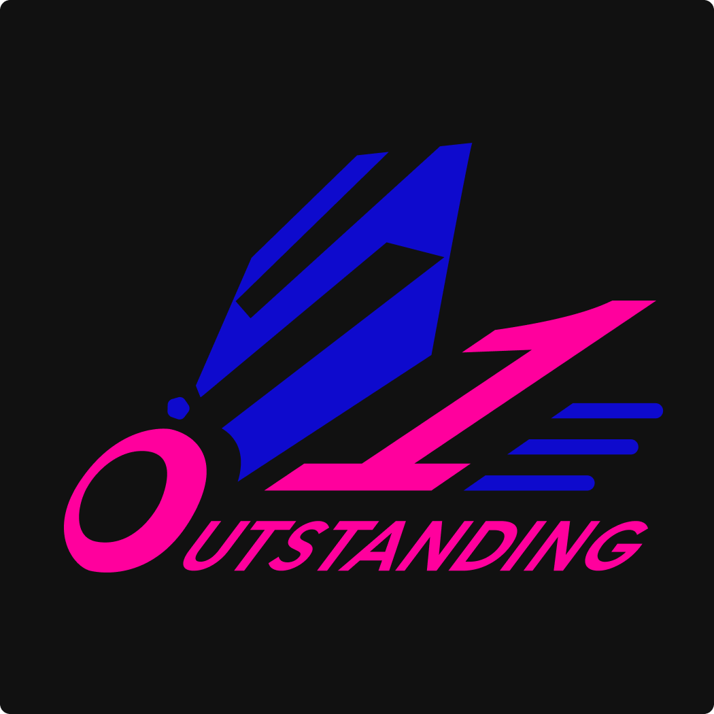

# 一支獨秀羽球工坊新版 LOGO 設計提案

**客戶：** 一支獨秀羽球工坊  
**設計師：** 萬能數維 | 謝萬錤 (Aries Hsieh)  
**日期：** 2026.03.05  
**版本：** v1.0

---

## 一、設計概念

### 核心主題：「一支獨秀」

整個 LOGO 以**羽球**為主視覺，將品牌名稱的精神具象化。  
羽球在球場上高速飛行、精準落點，象徵品牌在市場中出類拔萃、一枝獨秀的定位。

---

## 二、客戶手稿與設計轉譯

此版本依據客戶手稿忠實呈現，並在以下面向進行優化：

| 客戶手稿 1 | 客戶手稿 2 |
|---|---|
|  |  |

1. 將手繪草稿轉化為幾何化造型，提升各尺寸的辨識度與印刷適用性
2. O、S、1 三元素整合進羽球圖形，避免符號堆疊的雜亂感
3. 加入速度線條元素，強化動態張力，符合運動品牌的活力形象
4. 雙版本配色依不同使用情境設計，確保品牌在各媒材上均有最佳表現
5. 色彩依客戶指定色號 `#FF009D` / `#0E0ACD` 精準執行

---

## 三、造型解析

### 羽球主體

讓 O 及 S 字母及數字 1 購成的羽球部分以大面積**幾何塊面**構成，捨棄寫實細節，改用俐落的斜切線條，傳遞**速度感與現代感**。幾何化的處理讓 LOGO 在各種尺寸與材質下都能保持清晰辨識。

### O 字球頭

球頭以字母「**O**」的形狀呈現，同時讓圖形與英文字自然融合。  
O 同時是 **Outstanding** 的起始字母，**一形雙義**，圖與字渾然一體。

### 數字「1」

粉紅色的「**1**」與 字母「**S**」 構成在羽球羽毛之結構，成為整個畫面的**視覺焦點**。

- **1** 代表第一、頂尖、出眾
- 與品牌追求卓越的定位完全呼應
- 以客戶選擇之跳色強調，讓視線第一時間被吸引

### 速度線條

數字「1」右側延伸出三條**漸層速度線**，強化羽球高速飛行的動態感，也讓整體構圖在視覺上更加平衡穩定。

### OUTSTANDING 文字

品牌名稱沿著羽球底部展開，像是羽球飛行後留下的**軌跡**，讓圖文之間產生動態連結，而非單純的文字堆疊。

---

## 四、配色提案

本次提供**兩款配色版本**，風格各異，適用不同場景與媒材。

---

### 版本 A｜白底版（White Background）

| 色彩    | 色號      | 用途                                     |
| ------- | --------- | ---------------------------------------- |
| ⬜ 白色 | `#FFFFFF` | 底色                                     |
| 🟦 深藍 | `#0E0ACD` | 羽球主體、O 字、OUTSTANDING 文字、速度線 |
| 🩷 粉紅 | `#FF009D` | 數字「1」跳色強調                        |

**適用場景：** 名片、文件信頭、包裝、印刷品、淺色品牌物料  
**視覺氛圍：** 乾淨、專業、清晰，適合正式場合與印刷應用

---

### 版本 B｜黑底版（Black Background）

| 色彩    | 色號      | 用途                              |
| ------- | --------- | --------------------------------- |
| ⬛ 黑色 | `#111111` | 底色                              |
| 🟦 深藍 | `#0E0ACD` | 羽球主體、速度線                  |
| 🩷 粉紅 | `#FF009D` | 數字「1」、O 字、OUTSTANDING 文字 |

**適用場景：** IG 頭像、社群封面、球衣印刷、深色品牌物料  
**視覺氛圍：** 強烈、個性、電競感，在深色背景上衝擊力十足

---

## 五、設計理念補充

**色彩策略**

藍色 `#0E0ACD` 傳遞專業、信賴、競技感，在羽球運動中也是強勢用色。粉紅色 `#FF009D` 作為跳色，打破傳統運動品牌的保守印象，注入活力與個性，讓品牌在同類競品中更顯眼。兩色對比強烈卻不衝突，黑底版與白底版各自呈現截然不同的氣場，但品牌識別始終一致。

**斜向構圖**

整體以右上至左下的斜向結構貫穿，呼應羽球擊出後的飛行弧線，賦予靜態圖形動態的生命力。

---

## 六、應用場景

| 場景              | 建議版本           |
| ----------------- | ------------------ |
| IG 頭像、社群封面 | 黑底版             |
| 名片、文件信頭    | 白底版             |
| 球衣、運動服      | 依底色選擇對應版本 |
| 貼紙、球袋配件    | 兩版皆適用         |
| 刺繡、燙印        | 白底版（線條清晰） |

---

## 七、交付內容

- [x] 基礎版新 LOGO 設計（1 個方向、2 款色彩配色）
- [x] PNG 透明背景檔（高解析度）
- [ ] 其他格式檔案（如 SVG / AI / PDF，需另計）
- [ ] 視覺規範（Logo Guideline，需另計）
- [ ] 多尺寸版本（需另計）
- [ ] 商標申請文件與流程（需另計）

> **修改說明：** 本報價含 **2 次微調**（不含大改方向）。若需調整整體設計概念，將另行討論。

### 報價與交付範圍說明（本案）

- 提案數量：**1 個方向、2 款色彩配色**
- 修改次數：**2 次微調**（不含大改方向）
- 交付格式：**PNG 透明背景**
- 不包含：**視覺規範、多尺寸版本、商標申請**

---

_本提案著作權歸設計師所有，定稿並完成款項後著作財產權移轉予客戶。_
