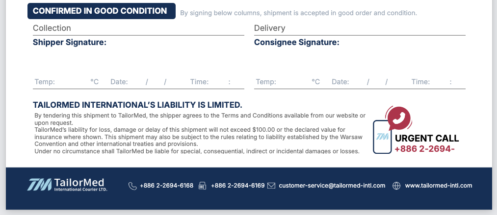
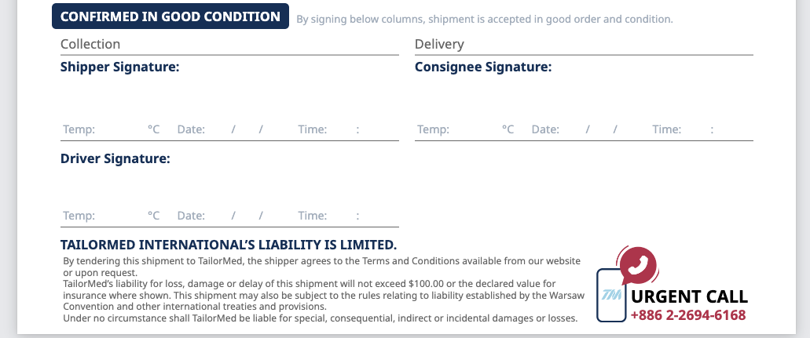

---
## Airtable Change Log

### 2026-01-22

### DataBase:【TailorMed】OMS

| 需求方 | 範圍(Table)    | 欄位(Field) | 異動 | 備註                                                          |
| ------ | -------------- | ----------- | ---- | ------------------------------------------------------------- |
|  Hedy   | ✏️ Release Check List for Collection | License Plate Number           | 新增 | Fedex | 
|  Hedy   | ✏️ Sample R/R Checklist | Lot Number           | 調整 | 寬度以符合文字不要斷行 |  

### DataBase:【TailorMed】FIN

| 需求方 | 範圍(Table)    | 欄位(Field) | 異動 | 備註                                                          |
| ------ | -------------- | ----------- | ---- | ------------------------------------------------------------- |
| Cody   | Charge Catalog | •           | 新增 | FRIGGA | 
| Cody   | Charge Catalog | ••          | 新增 | T7(2)-Pro, T7(0)-Pro | 

---
### 2026-01-20

### DataBase:【TailorMed】FIN

| 需求方 | 範圍(Table)    | 欄位(Field) | 異動 | 備註                                                          |
| ------ | -------------- | ----------- | ---- | ------------------------------------------------------------- |
| Cody   | Charge Catalog | •           | 新增 | CREDO | 
| Cody   | Charge Catalog | ••          | 新增 | Full Pallet | 
| Cody   | Charge Catalog | •••          | 新增 | S4 | 

---

### 2026-01-17

### DataBase:【TailorMed】FIN

| 需求方 | 範圍(Table)    | 欄位(Field) | 異動 | 備註                                                          |
| ------ | -------------- | ----------- | ---- | ------------------------------------------------------------- |
| Cody   | Charge Catalog | •           | 新增 | Empty Trip | 
---
### 2026-01-15

### DataBase:【TailorMed】FIN

| 需求方 | 範圍(Table)    | 欄位(Field) | 異動 | 備註                                                          |
| ------ | -------------- | ----------- | ---- | ------------------------------------------------------------- |
| Cody   | Charge Catalog | •           | 新增 | first 3 Taipei sites,4th Taipei site onward, Keelung, Cryobox |
| Cody   | Charge Catalog | ••          | 新增 | site                                                          |
| Cody   | Charge Catalog | Unit        | 新增 | site, Box                                                     |

### DataBase:【TailorMed】OMS > ✏️ Chain of Custody

| 需求方 | 範圍(Table)    | 欄位(Field)      | 異動 | 備註                         |
| ------ | -------------- | ---------------- | ---- | ---------------------------- |
| Cody   | Charge Catalog | Batch/Lot Number | 更改 | 欄位屬性 Lookup > Single Txt |
| Cody   | Charge Catalog | Product Quantity | 更改 | 欄位屬性 Lookup > Number     |
| Cody   | Charge Catalog | Data Logger      | 更改 | 欄位屬性 Lookup > Single Txt |

### DataBase:【TailorMed】OMS > ✏️ Sample R/R Checklist

| 需求方 | 範圍(Table)    | 欄位(Field)                                | 異動 | 備註                         |
| ------ | -------------- | ------------------------------------------ | ---- | ---------------------------- |
| Cody   | Charge Catalog | Batch/Lot Number (from AIRWAYBILL/POD NO.) | 更改 | 欄位屬性 Single Txt > Lookup |

### DataBase:【TailorMed】OMS > Page Desiner Extension

| 需求方 | 範圍(Table)            | 欄位(Field)       | 異動 | 備註               |
| ------ | ---------------------- | ----------------- | ---- | ------------------ |
| Cody   | Page Desiner Extension | 右上 Job No. 數字 | 更改 | Job No. > Ref. No. |

---

### 2026-01-13

### DataBase:【TailorMed】CRM

| 需求方 | 範圍(Table) | 欄位(Field) | 異動 | 備註                     |
| ------ | ----------- | ----------- | ---- | ------------------------ |
| Cody   | Quotations  | -           | 新增 | ❇️ Invoice Required 欄位 |

### DataBase:【TailorMed】OMS

| 需求方 | 範圍(Table) | 欄位(Field) | 異動 | 備註                                                                  |
| ------ | ----------- | ----------- | ---- | --------------------------------------------------------------------- |
| Cody   | Orders      | -           | 新增 | ❇️ Invoice Required 欄位 (Lookup Quotattions >❇️ Invoice Required 欄) |

### DataBase:【TailorMed】FIN

| 需求方 | 範圍(Table) | 欄位(Field) | 異動 | 備註                     |
| ------ | ----------- | ----------- | ---- | ------------------------ |
| Cody   | Quotations  | -           | 新增 | ❇️ Invoice Required 欄位 |

### DataBase:【TailorMed】FIN

| 需求方 | 範圍(Table)    | 欄位(Field)   | 異動 | 備註        |
| ------ | -------------- | ------------- | ---- | ----------- |
| Cody   | Charge Catalog | •             | 新增 | PharmaTherm |
| Cody   | Charge Catalog | National Code | 新增 | CA, IE      |

---

### 2026-01-11

### DataBase:【TailorMed】FIN

| 需求方 | 範圍(Table)    | 欄位(Field) | 異動 | 備註                               |
| ------ | -------------- | ----------- | ---- | ---------------------------------- |
| Cody   | Charge Catalog | -           | 新增 | Other 欄位供更多彈性的產品文字組合 |

---

### 2026-01-08

### DataBase:【TailorMed】OMS

| 需求方 | 範圍(Table)      | 欄位(Field)  | 異動                   | 備註                                   |
| ------ | ---------------- | ------------ | ---------------------- | -------------------------------------- |
| Hedy   | Order            | Order Status | 移除 & 調整 & 新增     | 移除 Draft 選項，調整次序，新增 Closed |
| Hedy   | 🟨 Package Items | -            | 移至第 3 個 Table 位置 | DUS                                    |

### DataBase:【TailorMed】CRM

| 需求方 | 範圍(Table) | 欄位(Field) | 異動 | 備註 |
| ------ | ----------- | ----------- | ---- | ---- |
| Ray    | Quotations  | POL & POE   | 新增 | DUS  |

### DataBase:【TailorMed】OMS

| 需求方 | 範圍(Table) | 欄位(Field) | 異動 | 備註 |
| ------ | ----------- | ----------- | ---- | ---- |
| Ray    | Flights     | POL & POE   | 新增 | DUS  |

### DataBase:【TailorMed】OMS

| 需求方 | 範圍(Table)                          | 欄位(Field)          | 異動 | 備註     |
| ------ | ------------------------------------ | -------------------- | ---- | -------- |
| Hedy   | ✏️ Release Check List for Collection | License Plate Number | 新增 | BQS-8776 |

| 需求方 | 範圍(Table)                       | 欄位(Field)      | 異動 | 備註                |
| ------ | --------------------------------- | ---------------- | ---- | ------------------- |
| Hedy   | ✏️ CHAIN OF CUSTODY Page Designer | Product Quantity | 調整 | 加寬以顯示 3 位數字 |

| 需求方 | 範圍(Table)    | 欄位(Field) | 異動        | 備註                                   |
| ------ | -------------- | ----------- | ----------- | -------------------------------------- |
| Cody   | AIRWAYBILL/POD | Footer      | 調整 & 新增 | Footer 版面調整 & 加上 Driver 的簽名區 |

---

### 2026-01-07

### DataBase:【TailorMed】FIN

| 需求方 | 範圍(Table)    | 欄位(Field) | 異動 | 備註 |
| ------ | -------------- | ----------- | ---- | ---- |
| Cody   | Charge Catalog | ••          | 新增 | 4/3  |

---

### 2026-01-06

### DataBase:【TailorMed】CRM & OMS

| 需求方 | 範圍(Table)      | 欄位(Field) | 異動     | 備註    |
| ------ | ---------------- | ----------- | -------- | ------- |
| Cody   | 🟨 Package Items | Temp Req.   | 新增項目 | Ambient |

### DataBase:【TailorMed】FIN

| 需求方 | 範圍(Table)    | 欄位(Field) | 異動     | 備註                   |
| ------ | -------------- | ----------- | -------- | ---------------------- |
| Cody   | Charge Catalog | •           | 新增項目 | Ambient Box, Bio Pouch |

### DataBase:【TailorMed】CRM

| 需求方 | 範圍(Table)   | 欄位(Field)                                                                                                                                                                                                                                                                                                                                                    | 異動                 | 備註                                                                                                                                     |
| ------ | ------------- | -------------------------------------------------------------------------------------------------------------------------------------------------------------------------------------------------------------------------------------------------------------------------------------------------------------------------------------------------------------- | -------------------- | ---------------------------------------------------------------------------------------------------------------------------------------- |
| Cody   | ✏️ Quotations | Requester / Requester Add / Email / Phone / Effective Date / Expiration Date / Payment Terms / O&D / Collection Co. / Collection Address / Delivery Co. / Delivery Address / Request Temp. / Package Count / Est. Wt. / Charge / Currency / Net Amount / VAT / VAT included / Total Amount(VAT) / NTC / NTC Amount / Total Amount / Prepare by / Prepare Email | 修改欄位 Description | 因 Ray 說在填表時會不確定哪些該填哪些不該填，也不確定哪些會出現在文件上，希望可以在欄位的說明加上"此欄內容會於 Quotation 文件中顯示"字樣 |

---

### 2026-01-05

### DataBase:【TailorMed】FIN

| 需求方 | 範圍(Table)    | 欄位(Field) | 異動     | 備註                                                                                |
| ------ | -------------- | ----------- | -------- | ----------------------------------------------------------------------------------- |
| Cody   | Charge Catalog | •           | 新增項目 | Nera, IC Biomedical                                                                 |
| Cody   | Charge Catalog | ••          | 新增項目 | M+56, M56, M+12, M12, M16, M28, D15, D6, V168, V36, 4/2, 4XD, CX100, XC CryoShipper |
| Cody   | Charge Catalog | •••         | 新增項目 | 15 ~ 25, 2 ~ 8, -15 ~ 25                                                            |
| Cody   | Charge Catalog | •           | 調整     | 移除 XC CRYOSHIPPER                                                                 |

---

### 2026-01-02

### DataBase:【TailorMed】OMS

| 需求方 | 範圍(Table)                        | 欄位(Field)      | 異動 | 備註                         |
| ------ | ---------------------------------- | ---------------- | ---- | ---------------------------- |
| Cody   | ✏️ AIRWAYBILL/POD Page Design 文件 | ITEM DESCRIPTION | 調整 | ITEM 品項名稱文字靠左        |
| Cody   | ✏️ AIRWAYBILL/POD Page Design 文件 | ITEM DESCRIPTION | 調整 | ITEM 品項列表由 3 列改 5 列+ |

---

### 2025-12-31

### DataBase:【TailorMed】OMS

| 需求方 | 範圍(Table)      | 欄位(Field)    | 異動 | 備註                |
| ------ | ---------------- | -------------- | ---- | ------------------- |
| Hedy   | 🟨 Package Items | Unit           | 新增 | KGM 一個項目        |
| Hedy   | 🟨 Package Items | Batch Quantity | 更改 | 無小數點改小數 1 位 |

---

### 2025-12-29

### DataBase:【TailorMed】CRM

| 需求方 | 範圍(Table) | 欄位(Field) | 異動 | 備註                                                                                                                                                                                                                                                        |
| ------ | ----------- | ----------- | ---- | ----------------------------------------------------------------------------------------------------------------------------------------------------------------------------------------------------------------------------------------------------------- |
| Cody   | Quotations  | POL & POE   | 新增 | 多項機場選項 BER、BNA、BOS、BUD、CAI、CAN、CBU、CLE、CPH、CTU、DEN、DFW、EDI、GLA、GRU、GVA、HAM、IAH、IND、JED、JNB、KHI、KWI、LHR、LUX、LYS、MAD、MLA、MNL、NLU、OSL、PEN、PER、PRG、RDU、SEA、SGN、STR、SZX、TFU、TLV、TUN、VNO、WAW、YVR、PHL、IAD、DRS |

### DataBase:【TailorMed】OMS

| 需求方 | 範圍(Table)                           | 欄位(Field) | 異動 | 備註                                                                                                                                                                                                                                                        |
| ------ | ------------------------------------- | ----------- | ---- | ----------------------------------------------------------------------------------------------------------------------------------------------------------------------------------------------------------------------------------------------------------- |
| Cody   | Flights                               | POL & POE   | 新增 | 多項機場選項 BER、BNA、BOS、BUD、CAI、CAN、CBU、CLE、CPH、CTU、DEN、DFW、EDI、GLA、GRU、GVA、HAM、IAH、IND、JED、JNB、KHI、KWI、LHR、LUX、LYS、MAD、MLA、MNL、NLU、OSL、PEN、PER、PRG、RDU、SEA、SGN、STR、SZX、TFU、TLV、TUN、VNO、WAW、YVR、PHL、IAD、DRS |
| Cody   | ✏️ Sample R/R Checklist               | Unit TXT    | 新增 | 新增欄位供 Page Designer 使用，Vials(複數)                                                                                                                                                                                                                  |
| Cody   | ✏️ Sample R/R Checklist Page Designer | Unit TXT    | 新增 | 新增顯示文字框，Vials(複數)                                                                                                                                                                                                                                 |

---

### 2025-12-26

### DataBase:【TailorMed】OMS

| 需求方 | 範圍(Scope/Table)               | 欄位(Field)     | 異動         | 備註                            |
| ------ | ------------------------------- | --------------- | ------------ | ------------------------------- |
| Cody   | ✏️ AIRWAYBILL/POD Page Designer | Data Logger No. | 修改文字大小 | 讓多筆 Data logger 可以全數顯示 |

---

### 2025-12-20

### DataBase:【TailorMed】OMS

| 需求方 | 範圍(Scope/Table) | 欄位(Field)              | 異動           | 備註                                                                                                  |
| ------ | ----------------- | ------------------------ | -------------- | ----------------------------------------------------------------------------------------------------- |
| Cody   | 🟨 Package Items  | Quantity, Batch Quantity | 新增, 修改格式 | 新增 Quantity 讓 Package Item 項目可以單獨計數, 原 Quantity 的文字改為數字格式並更名為 Batch Quantity |
