# Workflow & Flowchart

## Debit Note Entry Workflow

The following steps describe how a new record is created and completed in the **Debit Notes** table:

1. Create a new record in **Debit Notes**.
2. In **Quotation No.**, select the corresponding **Job No.**.
3. In **Order No.**, select the same **Job No.** as in _Quotation No._  
   (the system restricts the selection to matching records).
4. In **AIRWAYBILL/POD No.**, select the same **Job No.** as in _Quotation No._  
   (the system restricts the selection to matching records).
5. Fill in **Incoterms**.
6. Fill in **Item Description**.
7. In **🔴 Taxable Items (Temp)**, select all items that should be charged on this Debit Note.  
   The system will automatically transfer them into **🔴 Charge Items**.  
   Then, open each record in **🔴 Charge Items** and fill in **Amount** and **Quantity**.
8. Enter the **Exchange Rate**.
9. Select the **Currency**.
10. Enter the **VAT** rate.
11. If there are non-taxable items, select them in **🔵 Non-Taxable Items (Temp)**.  
    The system will automatically transfer them into **🔵 Non-Taxable Charges**.  
    (If there are no non-taxable items, skip this step.)
12. Set the **Status** of this Debit Note.
13. Add any relevant files in **Attachment**.  
    (If there are no attachments, proceed to the next step.)
14. Add any additional remarks in **Notes**.  
    (If there are no remarks, this field can be left blank.)
15. Select the **Bank Account** to be used for client remittance.
16. Fill in **Handled By** with the staff member responsible for this Debit Note.
17. The Debit Note entry is complete.

## Flowchart

```mermaid
flowchart TD
    A[Start - Create new Debit Note] --> B["Select Quotation No. (Job No.)"]
    B --> C["Select Order No.<br/>(same Job No.)"]
    C --> D["Select AIRWAYBILL/POD No.<br/>(same Job No.)"]
    D --> E[Fill in Incoterms]
    E --> F[Fill in Item Description]
    F --> G["Select items in 🔴 計稅品項-暫"]
    G --> H[System moves items to 🔴 Charge Items]
    H --> I["Open 🔴 Charge Items<br/>and fill Amount & Quantity"]
    I --> J[Enter Exchange Rate]
    J --> K[Select Currency]
    K --> L[Enter VAT rate]
    L --> M{Any non-taxable items?}
    M -->|Yes| N["Select items in 🔵 不計稅品項-暫"]
    N --> O[System moves items to 🔵 Non-Taxable Charges]
    O --> P[Set Status]
    M -->|No| P[Set Status]
    P --> Q["Add Attachment (if any)"]
    Q --> R["Add Notes (if any)"]
    R --> S[Select Bank Account]
    S --> T[Fill in Handled By]
    T --> U[Debit Note entry completed]
```

