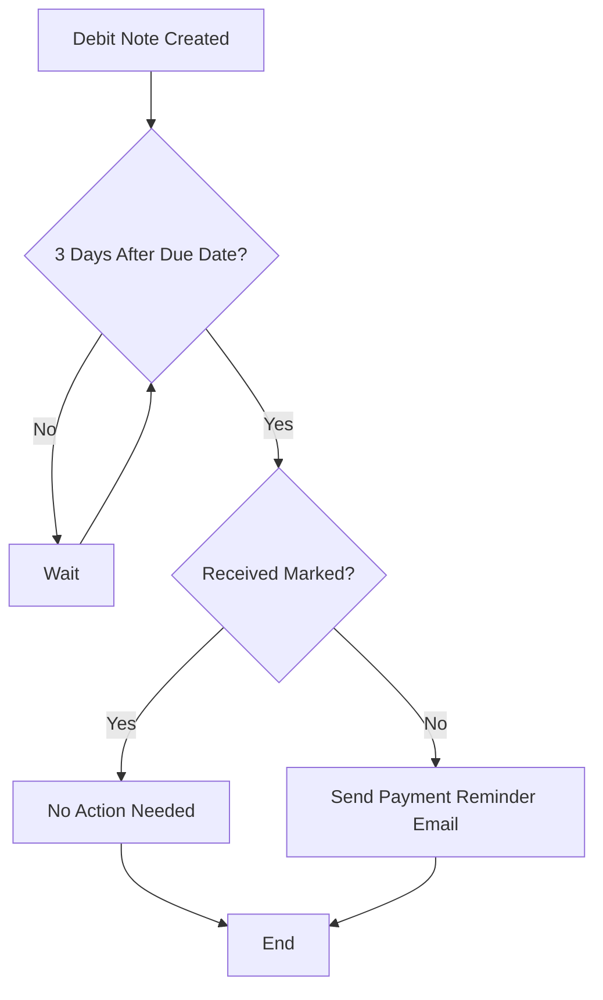
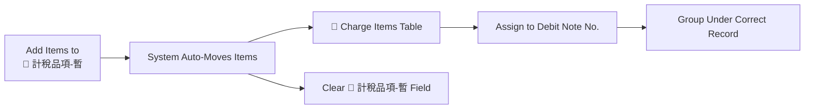
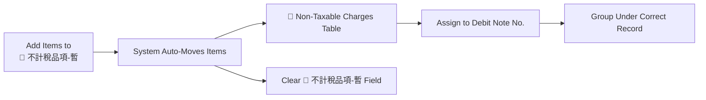
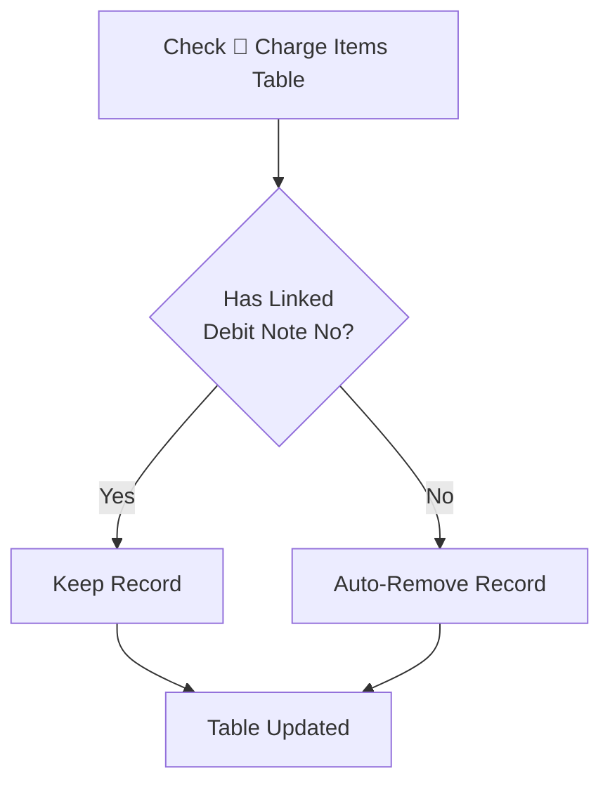
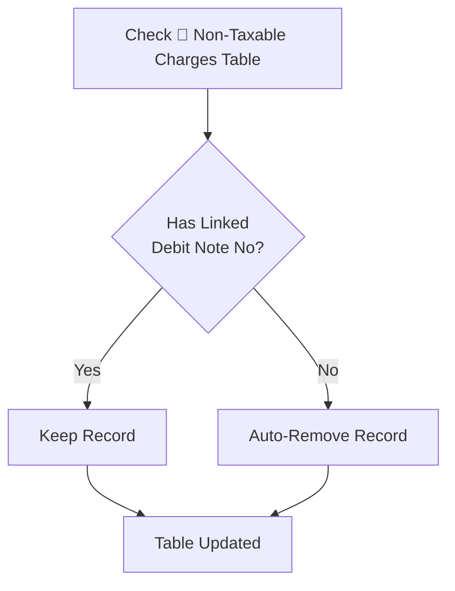

# Automation

This database includes four automation routines designed to maintain accuracy, consistency, and synchronization in the Debit Note workflow.

---

## 1. Invoice Due Date Notification

If a Debit Note remains unmarked in the **"Received"** field for **3 days after the due date**, the system automatically sends a payment reminder email.

**Email Details**

- **Subject:** 🔔 Upcoming Payment Reminder – Invoice: TMXXXXXXXX
- **To:** cody@tailormed-intl.com
- **CC:** ray@tailormed-intl.com

This automation ensures overdue payments are followed up promptly.

### Flowchart

---

## 2. 🔴 🔵 Item Table Auto Grouping

### a. Charge Items (🔴)

When items are added to **"🔴 計稅品項(暫)"** in the Debit Note:

- The system automatically moves the selected items into **"🔴 Charge Items"**.
- The temporary field **"🔴 計稅品項(暫)"** is cleared.
- In the **"🔴 Charge Items"** table, the system assigns these items to the corresponding **Debit Note No.**, grouping them under the correct record.

#### Flowchart - Taxable Items

### b. Non-Taxable Items (🔵)

When items are added to **"🔵 不計稅品項(暫)"** in the Debit Note:

- The system automatically moves the selected items into **"🔵 Non-Taxable Charges"**.
- The temporary field **"🔵 不計稅品項(暫)"** is cleared.
- In the **"🔵 Non-Taxable Charges"** table, the system assigns these items to the corresponding **Debit Note No.**, grouping them accordingly.

#### Flowchart - Non-Taxable Items

---

## 3. Auto-Remove Orphan Items (🔴 Charge Items)

Any record in **"🔴 Charge Items"** that does **not** have a linked **Debit Note No.** is automatically removed.  
This prevents outdated or unassigned billable items from remaining in the table.

### Flowchart

---

## 4. Auto-Remove Orphan Items (🔵 Non-Taxable Charges)

Any record in **"🔵 Non-Taxable Charges"** that does **not** have a linked **Debit Note No.** is automatically removed.  
This ensures the non-taxable charge list stays clean and synchronized with active Debit Notes.

### Flowchart

---
