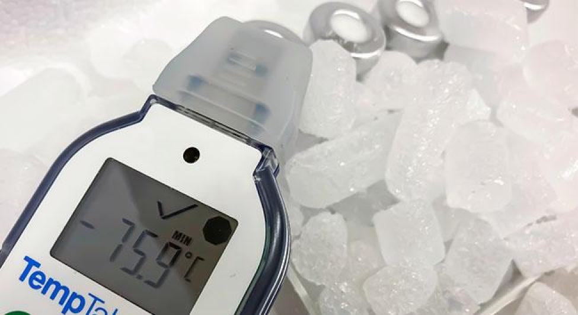

# Packaging and Preconditioning

## Safe guarding Your Shipments: Expert Packaging and Preconditioning    
TailorMed is dedicated to providing reliable and effective packaging solutions for the safe transportation of temperature-sensitive products. Our expertise lies in understanding the unique challenges of your supply chain and delivering tailored packaging solutions to meet your specific needs.

We offer a comprehensive range of thermal shippers, insulated containers, and passive and active packaging options to accommodate a wide range of temperature requirements, from controlled room temperature to cryogenic conditions. Our preconditioning services ensure that your packaging is ready to use, minimizing the risk of temperature excursions. 

## Our Cold Chain Service Covers
- 15-25°C
- 2-8°C
- -15 to -25°C
- -60 to -80°C
- -196°C

We prioritize quality and compliance, conducting rigorous shipping validations to guarantee the performance of our packaging solutions. By partnering with TailorMed, you can be confident that your valuable products are protected throughout the supply chain.

> *By partnering with TailorMed, you can be confident that your products are handled with the utmost care.*