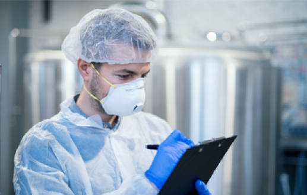

# Quality Assurance

## Temperature Control, Quality Assured.

TailorMed is dedicated to safeguarding the quality and integrity of temperature-controlled shipments across the healthcare, biotech, pharmaceutical, and IVF industries. Our comprehensive quality assurance program is designed to meet the stringent requirements of these sectors.

As an ISO 9001 certified company, we adhere to the highest quality standards. Our GDP compliance ensures the safe handling and distribution of temperature-sensitive products. We invest in ongoing personnel training and facility validation to maintain the highest level of service.

## Our Solutions
### Bio Samples

Our expertise extends to the handling of blood, tissue, and urine samples, ensuring the highest levels of care and precision. With our ability to manage all temperature ranges, from cryogenic to ambient, you can trust us to maintain the integrity of your precious biospecimens.

### Clinical Trial

We manage all phases of clinical trials, from research to commercialization, with specialized equipment for ultra-low and room temperature shipments. Our strong supply chain and advanced tracking ensure product integrity and on-time delivery.

### Pharmaceuticals

TailorMed provides comprehensive logistics solutions for the pharmaceutical industry, specializing in the safe and efficient transport of products from small-batch biologics to bulk API shipments.

### In Vitro Fertilization

We offer a comprehensive solution, from sample collection to delivery, ensuring optimal conditions throughout the entire process. Our state-of-the-art packaging, equipped with GPS tracking, provides real-time visibility and peace of mind.

### Vaccine

Our expertise encompasses a wide range of vaccine types, including mRNA, viral vector, and protein-based vaccines. We have the capabilities to maintain both ultra-cold and refrigerated temperature conditions throughout the entire supply chain. 

### Cell & Gene Therapy

we specialize in high-quality logistics for cell and gene therapy, ensuring the safe and precise delivery of life-changing treatments. 

> *By partnering with TailorMed, you can be confident that your products are handled with the utmost care.*