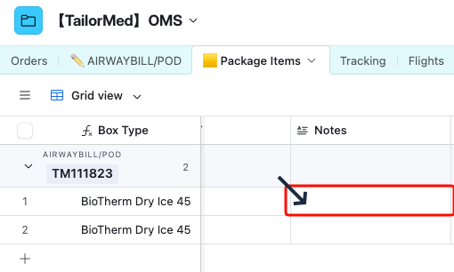
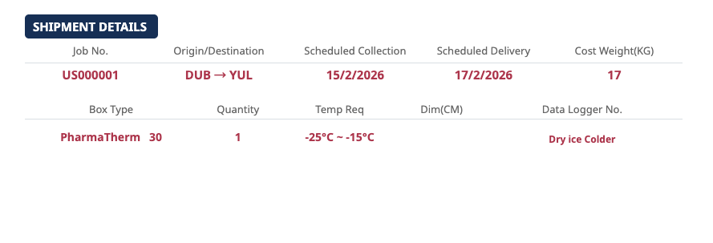
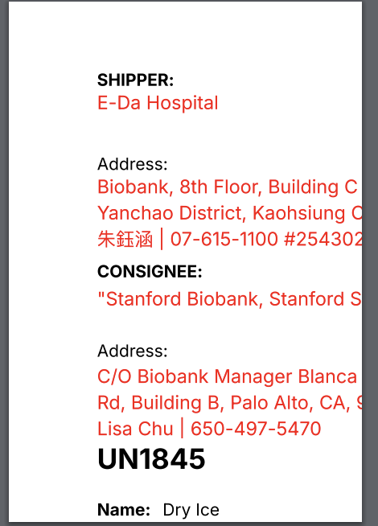

# 會議記錄

## **主題：OMS 資料庫使用及調整討論**

---

## 一、基本資訊

- **會議時間：** 2026-02-18（週三）14:00
- **會議地點：** 視訊會議（Google Meet）
- **與會人員：** Hedy, Aries

---

## 二、背景說明

在一陣子的資料庫使用後，發現到一些跟結構有關的問題在此提出討論。

## 三、討論重點摘要

- Debit Note 及 AWB/POD 的相應資料(Package Item 及 Charge Item)，均以 CRM 的 Quotation 開立之內容為準，OMS 及 FIN 的資料會以繼承的方式來進行。

- OMS 中的 AWB/POD 之 Package Item 中重量及數量欄位都是以 Quotation 的內容為準，並僅提供 Estimated Weight 作參考；實際在運務安排這段(OMS)則多加一欄可填寫之 Cost Weight 作為後續請款依據。
  - ⭐重要：上述均會有一定幅度更改資料庫的結構，待確定後再進行。

- 新問題產生：在 OMS 階段有產生 Quotation 未列之費用要怎麼反應給 Debit Note 去呈現。
  - 擬作法：在 Order 或是 AWB/POD 表中之 Note 欄位 用來記錄費用，並在 Debit Note 中加關聯欄進行提示。
    
- AWB/POD 列印文件呈現有需要調整
  - 1.在 右上原本 Ref.No. 下加上 Tracking No. 讓人員方便透過網址查單
    
  - 2.Shipment Deatils 的表格內容調整：移除 AWB No., Gross Weight, Volume Weight 及 Chargeable Weight 欄位，並加上 Cost Weight 欄位內容
    
    擬調整如以下：
    
- Dry ice label 列印文件因業務調整，需要要改用標籤機 (W100mm x H148mm) 格式來列印，需要調整請先提供排版圖檔。
  - 調整後的列印文件會如以下：
    
    - 文字內容需重新排整

## 四、其他討論

展示 US FIN Base 的 Debit Note Interface One-Click Match 操作

## 五、待辦事項

- [ ]相關報價單提供，會包含以下：
  - 1.CRM 合併 Sales Rep. Interface (含可正式操作功能：包含列表，可編輯詳細資料，新增項目)報價單
  - 2.FIN Interface with One Click Match 功能(可正式操作功能如 CRM Interface)報價單
  - 3.Airtable Editor Seat (ray@tailormed-intl.com)與系統授權報價單
  - 4.Master Database 建置及 Interface 報價單

- [] 安排時間展示 US Database 操作 - 從 CRM > OMS > FIN
  以台灣 Base 中之 TM111934 及 TM111909 兩票為例
  - ⭐ 請先確認 TM111909 之 Quotation 及 Debit Note 訂單的金額及計價品項

---

- **最後更新：** 2026-02-24
- **文件版本：** v1.0
- **文件負責人：** Aries
