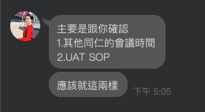

# 會議記錄

## **主題：UAT 需求 & 資料庫第一版 SOP & 報價單相關**

---

## 一、基本資訊

- **會議時間：** 2026-03-15 09:00 - 11:00
- **會議地點：** Google Meet
- **與會人員：** Cody；Aries

---

## 二、背景說明

## 三、討論重點摘要

### 新同仁稱呼確立：

- 日本新同仁：Nancy
- 北美同仁：Martha

### NOVATech 稽核後的一些事項反應

在稽核時需要的文件不齊全，主要是：

- Airtable 資料登錄的 SOP
- Airtable 系統的 UAT 文件

Cody 提及：

未來會嘗試著合併 ISO 9001 與當前一直在進行的 GDP，故先前有提及要進行的
SAQ(Supplier Audit Questionnaire)供應商稽核文件數位化，在未來也考量納入欲執行之專案計劃中。

SAQ 研擬作法參考：百濟神洲  
該客戶採「廠商平台」(Supplier Portal) 作法：

- 由廠商自行登入並維護相關資料，包含稽核填單皆於平台上完成。
- 平台需與企業內部業務資料庫分離(使用第三方服務)，確保資料獨立與安全性。
- 平台預期提供之功能包含：基本資料維護更新、訂單通知、稽核資料歷史記錄...等。

**建議參考：此類廠商平台如何實現（實作方向）：**

1. **系統邊界與資料分離**
   - 廠商平台為**獨立系統**（獨立主機／子網域或雲端服務），不直接連線崴宇內部業務 DB。
   - 與內部系統僅透過 **API 或排程同步** 交換必要資料（例如：只同步「需通知廠商之訂單摘要」、稽核表單狀態），內部敏感資料不落地到平台。

2. **身分與權限**
   - 廠商帳號獨立管理（可整合 SSO 或專用登入），一廠商一帳號（或依需求多帳號＋角色）。
   - 僅能存取該廠商自己的訂單、稽核紀錄與可維護之基本資料，權限矩陣需事先定義。

3. **功能模組可拆解為**
   - **訂單通知**：由內部系統觸發（或排程）推送訂單摘要／連結至平台，廠商在平台查看或下載。
   - **稽核填單與歷史**：平台提供表單（如 SAQ）填寫、送出；紀錄存於平台 DB，可查歷史；必要時再以 API 回寫或同步狀態至內部。
   - **基本資料更新**：廠商可於平台更新聯絡人、地址等；可設計為「送出後由內部審核後同步」或「限定欄位即時更新並同步」。

4. **技術選型建議**
   - 前端：一般 SPA 或表單導向即可（如 React / Vue 或低程式碼表單工具）。
   - 後端：獨立服務＋獨立 DB；與內部系統以 REST/API 或訊息佇列溝通。
   - 部署：可放於對外網段或雲端，與內部環境網路隔離，僅開放必要 API 白名單。

5. **分階段實施**
   - 第一階段：廠商登入＋基本資料維護＋單一稽核表單（如 SAQ）線上填寫與歷史查詢。
   - 第二階段：訂單通知（由內部觸發或排程推送）。
   - 第三階段：依需求擴充更多表單或審核流程。

---

## 四、其他討論

- **發票有無收到**
  - ✓ 已收到，會協助請款
- **US Base 與 Interface 後續**
  - ✓ 北美基礎設施(網路申請事宜)尚在籌備中，故 Interface 的使用及測試還有一些時間。

- **接下來工作項目的優先次序**
  - １.Interface Demo 後，確立沒有問題就可以開始進行，項目包含：
    - ➊ TW Inteface
    - ➋ Master Base & US Base
    - ➌ US Interface
  - ２.包材 (Package Items) 庫存管理系統  
    現況：包材目前無明確庫存管理，在庫品項各有專屬編號；取用後常無法掌握庫存數量與剩餘可用編號，導致控管困難。  
    期望：透過 OMS 的 Package Item 取用流程，對包材庫存做精確管理，以利採購與補充作業。  
    ※ 此為全新功能，可能涉及資料結構調整及新增表單、邏輯設定；後續將安排現場訪談以了解實際作業場景，以利功能規劃與開發。

- **Airtable 的 Interface 如何防呆(比方資料重覆一事)**
  - ✓ 目前填單防呆機制僅限於 Interface 中新增項目的填單欄位中，由於權限緣故，系統不會限制即有資料內容的填寫。故建議可以先建立內部填單的 SOP，以降低未來新進同仁在填單時誤操作的可能。
- **下次拜訪時間**
  - ✓ 預計週四 (3/17 下午時段)

## 五、待辦事項

- **我方待辦事項：**
- [ ] 提供 【TailorMed】CRM/OMS/FIN Database UAT 文件 (驗收日訂於：2026/01/31 已加入 FIN > SoA 功能)
- [ ] 開設 Airtable 帳號使用權限(chris@tailormed-intl.com)
- [ ] 提供 Airtable 權限矩陣作為資料庫使用之參考（可參照 [Airtable 權限矩陣範本](../../Airtable/權限矩陣範本.md)）
- [ ] 預備週四(3/17)Demo 相關資料，以 Mail 內容為主，以利摸擬真實業務現場情況。

- **客戶端待辦事項：**
- [ ] 提供至少 3 份完整流程(CRM > OMS > FIN)樣本郵件及文件以利 US Databse & Interface 填單測試
- [ ] 確認同仁 Chris 於 Airtable 權限的起始日
- [ ] 提供 Tracking 頁面的 Feedback Form 連結

### 其他備考

**Airtable 權限規劃參考**

**Base 使用權限（角色 × Base）**

| 角色／人員       | CRM Base | OMS Base | FIN Base | 備註             |
| ---------------- | -------- | -------- | -------- | ---------------- |
| 營運／管理 (op@) | Editor   | Editor   | —        | 運務主責         |
| 財務 (fin@)      | Editor   | —        | Editor   | 財務人員主責     |
| 業務 Ray (ray@)  | Editor   | Editor   | Editor   | 全權主責         |
| 業務 (chris@)    | —        | —        | —        | 僅透過 Interface |

**Interface 使用權限 (預覽，待正式上線參照配置)**

_Sales Rep.（獨立 Interface 包含：Overview / Partners / Contacts / ATTNs / Quotations）_

| 角色／人員    | Sales Rep. Interface              | 備註             |
| ------------- | --------------------------------- | ---------------- |
| 業務 (chris@) | List 指定欄位、資料詳情及有限操作 | 僅透過 Interface |

---

- **最後更新：** 2026-03-16
- **文件版本：** v.1.0
- **文件負責人：** Aries
