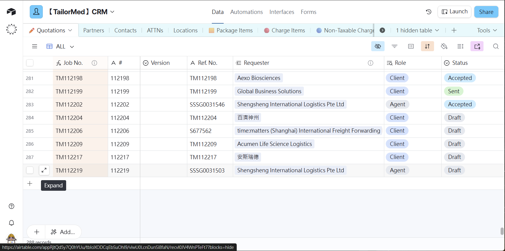
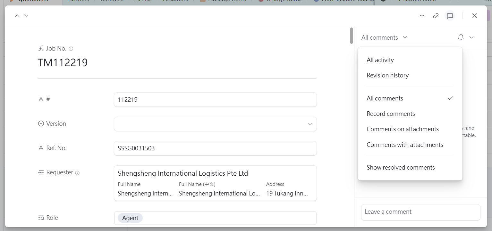
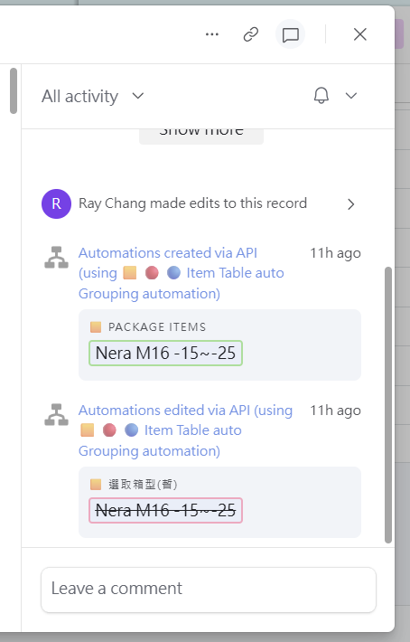

# 會議記錄｜20260320 Interface Demo

## 一、基本資訊

| 項目     | 內容                          |
| -------- | ----------------------------- |
| 主題     | Airtable US Interface Demo    |
| 時間     | 2026-03-20　14:00–16:30       |
| 地點     | 現場討論                      |
| 與會人員 | Cody, Hedy, Ray, Chris, Nancy, Aries |

---

## 二、背景說明

本次 Demo 展示目前已開發約 60% 功能的 US Airtable Interface，涵蓋 CRM、OMS、FIN 三個系統，目的是蒐集對現有功能的回饋，並確認後續開發方向。

---

## 三、討論重點與功能需求

### 跨系統 / 通用

- Q：「是否在 Airtable 裡有記錄每一筆資料的歷史編輯？」by Cody
  - A: 如下附圖
  
  
  
- 未來考慮要加入**預先付款（Prepayment）**功能
- Collection / Delivery Co. 的 **ATTNs 欄位需設為必填**
- 在不同廠商配合的專案 Quotation 中， **EXP. Date**，因會有談季或是年約，故需支援手動修改（Customize）by Chris
- 列印文件時 **USD 金額字體需加大** by Chris

### CRM Base / Interface 調整

- 於 Quotation 連結之 Package Item 的 **Item Description 為業務人員填寫項目，以利 OMS 安排後續 AWB/POD 文件之產出

### OMS

- Order 中需建立對應 Job（Quotation）的**防呆機制**，避免重複加單
- FIN 中需連結之 CRM/OMS 亦同

### FIN

- Debit Note → Charge Item / Non-Taxable 需支援**新增項目**（Add New Item(s) Below）
- **Invoice No.** AutoNumber 規則可呈現自動。以發票的開立日為依據 by Ray

### 其他

- 庫存系統流程規劃（採購 → 入庫 → 出貨）
  - 因為工作邏輯尚在釐清中，後續將會再約同相關入員進行討論。

- Novotech 稽核後，有提及想開放 API 接口，讓崴宇透過資料登錄及上傳。
  - 此為 B2B 的整合方案，目的在於透過 TailorMed 溫度計數據對接 Novotech 系統，考量到技術的面向以及不同方式可能帶來的工作複雜度。先提供初步可行方案的文件[API Intergration](TailorMed_Novotech_API整合方案.md)給予參考，待後續需要進一步討論可再約相關人員進行討論。

---

## 四、討論重點摘要

1. 整體介面流程獲得正面回應，整體操作及系統實用面向相較於資料庫表單的操作更為直覺，在此基礎上會讓內部的作業效率更加提升。
2. 為符合不同情境(一般 vs 專案)使用的需求，目前先以一般作業可行方向續行，待後續若專案的廠商需求量增加，再考量專案資料庫及 Interface 的開發。
3. 
---

## 五、待辦事項

- **我方待辦事項：**
- [ ] 提供正式的 TW Interface 開發合約文件，先前提供的報價單以 SoA 方式呈現。
- [ ] 修改 Dry Ice Label 樣版

- **客戶端待辦事項：**
- [ ] 提供 Tracking 頁面的 Feedback Form 連結
- [ ] 提供 Dry Ice Label 的 Word or Google Doc 樣本
---

_最後更新：2026-03-20　|　版本：v1.1　|　負責人：Aries_
