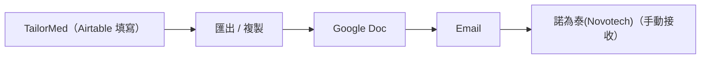
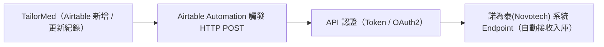
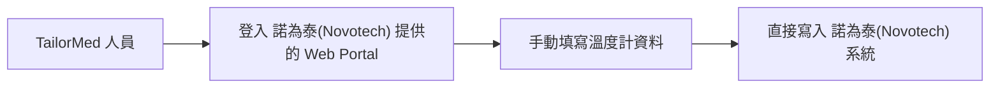

# TailorMed × 諾為泰(Novotech) — API 資料整合方案

> 文件目的：整理 TailorMed 冷鏈溫度計數據對接 諾為泰(Novotech) 系統的可行方案，
> 以及後續需向 諾為泰(Novotech) 確認的事項。

---

## 現況說明

| 項目     | 說明                                                                                                 |
| -------- | ---------------------------------------------------------------------------------------------------- |
| 運輸方   | TailorMed（冷鏈運輸）                                                                                |
| 收件方   | 諾為泰(Novotech)                                                                                   |
| 目前作法 | 將溫度計資料填入 Google Doc 後，以 Email 通知 諾為泰(Novotech)                                               |
| 現有資料 | Airtable 中已有溫度計編號 (Data Logger No.)                                                          |
| 需求來源 | 諾為泰(Novotech) 提出：會開放自己的 API，讓 TailorMed 接上後並回傳溫度計數據至 諾為泰(Novotech) 系統，以節省通報流程 |

---

## 三種方案比較

### 方案 A：維持現有流程（Email 通知）

**流程**

**優點**

- 不需任何技術開發
- 雙方都熟悉操作方式

**缺點**

- 全程手動，容易漏傳或格式不一致
- 不符合 諾為泰(Novotech) 要求
- 無法即時追蹤傳輸狀態

**適用情境**：短期過渡期，等待正式方案確認前使用。

---

### 方案 B：Webhook 自動推送（推薦 但需測試）

**流程**

**說明**

諾為泰(Novotech) 提供一個 API endpoint，TailorMed 在 Airtable 中完成資料登錄後，由 Automation 自動將資料以 JSON 格式 POST 過去，無需人工介入。

Airtable 原生支援 Automation → Send HTTP Request，不需另外開發後端程式。

**優點**

- 真正的自動化，減少人為錯誤
- 可設定觸發條件（例如：狀態欄改為「已出貨」時自動推送）
- 每筆傳輸可留下 Log 紀錄，便於稽核追蹤
- 符合 諾為泰(Novotech) 「API 接口」的要求

**缺點**

- 需要 諾為泰(Novotech) 提供 API Spec 及認證憑證
- 需確認 Airtable 端的欄位格式與 諾為泰(Novotech) 的資料格式一致

**技術需求**

- 諾為泰(Novotech) 提供：API endpoint URL、認證方式、JSON schema
- TailorMed 提供：Airtable Automation 設定

---

### 方案 C：Web Portal 人工登錄

**流程**

**說明**

諾為泰(Novotech) 提供一個有帳號權限控管的網頁介面，TailorMed 人員以帳密登入後，直接在上面填入溫度計資料，資料即時進入 諾為泰(Novotech) 系統，不需 Email 往返。

**優點**

- 格式統一，不會有格式錯誤問題
- 資料直接進入 諾為泰(Novotech) 系統，即時可查
- TailorMed 端不需任何技術設定

**缺點**

- 仍需人工操作，無法自動化
- 若 諾為泰(Novotech) 沒有現成 Portal，需要對方開發
- 登入帳密的管理與權限控制需要規範

**適用情境**：諾為泰(Novotech) 已有現成 Portal，或短期內不需自動化時的過渡方案。

---

## 方案比較總覽

| 比較項目       | 方案 A（Email） |  方案 B（Webhook）  | 方案 C（Portal） |
| -------------- | :-------------: | :-----------------: | :--------------: |
| 自動化程度     |       無        |         高          |        低        |
| 技術開發需求   |       無        | 低（Airtable 設定） | 需 諾為泰(Novotech) 開發 |
| 人工介入       |       高        |         無          |        有        |
| 格式一致性     |     不穩定      |         高          |        高        |
| 符合稽核要求   |       否        |         是          |       部分       |
| 可追蹤 Log     |       否        |         是          |       部分       |
| **建議優先度** |     過渡期      |     ✅ 優先推薦     |       次選       |

---

## 資料安全基本要求

不論採用哪種方案，以下安全條件都應確保：

| 項目            | 說明                                                           |
| --------------- | -------------------------------------------------------------- |
| 傳輸加密        | 所有資料傳輸必須使用 HTTPS（TLS 1.2 以上）                     |
| 身份驗證        | API Key 或 OAuth 2.0，不可使用明文帳密                         |
| IP 白名單       | 限制只有 TailorMed 的 IP 可呼叫 諾為泰(Novotech) API                   |
| 最小權限原則    | API 憑證只開放「寫入溫度紀錄」的權限，不可有讀取其他資料的權限 |
| 稽核紀錄（Log） | 每一筆傳輸須記錄：時間、傳送方 IP、資料內容摘要、成功/失敗狀態 |
| 錯誤通知機制    | 推送失敗時應觸發告警，避免資料漏傳而無人知曉                   |

---

## 現有 Airtable 資料的不足之處

目前 Airtable 中僅有「入箱溫度」，冷鏈稽核通常需要更完整的資料。建議確認以下欄位是否需要補充：

| 欄位                          | 現況   | 建議                         |
| ----------------------------- | ------ | ---------------------------- |
| 溫度計設備 ID                 | 已有   | 確認命名規則與 諾為泰(Novotech) 對應 |
| 入箱溫度                      | 預規劃 | 規劃中                       |
| 出箱溫度（到貨讀值）          | 未知   | 建議新增                     |
| 全程溫度曲線（每 N 分鐘一筆） | 未知   | 視溫度計型號而定             |
| 出貨單號 / Lot Number         | 未知   | 建議確認對應關係             |
| 時間戳記格式                  | 未知   | 建議統一使用 UTC ISO 8601    |

> 注意：全程溫度曲線的可行性取決於溫度計型號（USB 下載型 vs 藍牙 vs 即時上傳型），
> 需先確認硬體能力。

---

## 需向 諾為泰(Novotech) 確認的事項

### 一、釐清整合方向（最優先）

- [ ] **方向確認**：諾為泰(Novotech) 說的「開放 API 接口」，是指：
  - (A) 由 諾為泰(Novotech) 提供 API endpoint，讓 TailorMed 推送資料（方案 B）
  - (B) 由 TailorMed 建立 API，讓 諾為泰(Novotech) 主動來拉取資料
  - (C) 諾為泰(Novotech) 提供 Web Portal 讓 TailorMed 人員登入填寫（方案 C）

  > 兩種方向的技術責任歸屬完全不同，必須先確認。

### 二、技術規格（方案 B 適用）

- [ ] 是否有 API 規格文件（Spec / Swagger）？
- [ ] API endpoint URL 為何？
- [ ] 認證方式為何？（API Key / OAuth 2.0 / 其他）
- [ ] 資料格式需求（JSON schema）？必填欄位有哪些？
- [ ] 溫度單位規範（攝氏 °C / 華氏 °F）？
- [ ] 時間戳記格式需求？是否指定時區？
- [ ] 是否有沙盒（Sandbox）測試環境可供驗證？
- [ ] 單次可傳多筆資料（Batch）？還是一次只能傳一筆？

### 三、安全與存取控制

- [ ] 是否要求 IP 白名單？如是，需提供 TailorMed 的固定 IP
- [ ] API Key 的申請流程與有效期限為何？
- [ ] 雙方是否都有 HTTPS 傳輸的要求或確認？

### 四、資料內容確認

- [ ] 諾為泰(Novotech) 需要哪些欄位？（溫度計 ID、入箱溫度、出箱溫度、全程曲線、時間、單號...）
- [ ] 溫度計設備 ID 的命名規則，是否與 TailorMed 的編號系統一致？
- [ ] 是否需要完整的全程溫度曲線？如果需要，每幾分鐘一筆？

### 五、後續維運

- [ ] 推送失敗時的處理機制？（重試次數、錯誤通知）
- [ ] Log 保存期限要求？（通常稽核要求 2–5 年）
- [ ] API 版本更新時的通知與銜接流程？

---

## 方案 C 延伸討論：若 諾為泰(Novotech) 要求 TailorMed 自建 Portal

### 背景

根據 TailorMed 回饋，諾為泰(Novotech) 的實際要求是：由 TailorMed 自行開發一個 Web Portal，填寫資料後再接入 諾為泰(Novotech) 的 API 進行回傳。這與方案 C 原先假設「由 諾為泰(Novotech) 提供 Portal」的方向相反，實質上是將整合成本完全轉嫁給供應商。

### 為什麼 諾為泰(Novotech) 會這樣要求？

這在生技/製藥供應鏈中是相當常見的現象，通常有以下幾種原因：

1. **成本轉嫁**：大客戶要求小供應商自費建系統、自行接 API，整合與維護成本由下游全部承擔，大客戶不需投入任何資源。
2. **IT 資源不足**：諾為泰(Novotech) 可能有可用的 API，但內部 IT 排程排不上，或缺乏 API First 的開發文化，導致「有 API、沒 Portal」的狀態。
3. **管理多家供應商**：若 諾為泰(Novotech) 有多家冷鏈供應商，要求每家各自建系統接入，是一種「我統一管、你各自做」的管理模式，對 諾為泰(Novotech) 而言最省事。

### 潛在問題（風險）

| 風險項目                      | 說明                                                             |
| ----------------------------- | ---------------------------------------------------------------- |
| 開發成本由 TailorMed 獨自承擔 | 包含設計、開發、測試、上線，費用不低                             |
| 維護責任落在 TailorMed        | 諾為泰(Novotech) 若更新 API 規格，TailorMed 須配合修改，無法拒絕         |
| 議價力問題                    | 諾為泰(Novotech) 仍掌握 API 規格的定義權，TailorMed 處於被動             |
| 資料安全責任自負              | Portal 若有資安漏洞，責任在 TailorMed，而非 諾為泰(Novotech)             |
| 投資回收風險                  | 若 諾為泰(Novotech) 日後更換供應商或終止合作，Portal 的開發投入即報廢    |
| 談判籌碼缺失                  | 系統一旦建好、接入完成，TailorMed 反而失去要求補貼或談條件的時機 |

### 潛在機會

儘管有以上風險，若 TailorMed 決定做，這件事也可以從另一個角度來看：

| 機會項目     | 說明                                                               |
| ------------ | ------------------------------------------------------------------ |
| 數位差異化   | 在冷鏈運輸業中，具備數位回報能力是超越同業的技術門檻               |
| 平台擴展潛力 | 若系統設計為通用架構，可對接多家藥廠、CRO 或醫院，不限於 諾為泰(Novotech)  |
| 服務增值     | 平台可延伸提供溫度報表、全程追蹤、稽核文件匯出等加值服務           |
| 長期客戶黏著 | 一旦對接完成，換供應商的成本提高，有助於穩定與 諾為泰(Novotech) 的合作關係 |

### 關鍵建議

**1. 動手前先談成本分攤**

在開發之前，TailorMed 應嘗試將開發成本納入合約談判，例如服務費加成、專案費用補貼，或要求 諾為泰(Novotech) 提供穩定的 API 版本承諾（版本凍結期）。一旦系統建好，談判籌碼就消失了。

**2. 從一開始就設計為通用平台，而非 諾為泰(Novotech) 客製系統**

若只為 諾為泰(Novotech) 量身打造，風險集中、投資難回收。若從架構上設計為可對接多家客戶的通用平台，諾為泰(Novotech) 的需求只是第一個案例，後續可複製到其他藥廠或 CRO，投資的邊際效益才划算。

**3. 明確規範維護責任歸屬**

Portal 建好後，誰來負責日常維護、API 版本跟進、帳號管理、資料格式調整？這件事在開發前就要講清楚，否則容易變成「做出來沒人管」的爛攤子。

**4. 評估是否需要外部開發資源**

若 TailorMed 內部沒有開發能力，需要外包，則成本估算、廠商選擇、後續維護合約都需要一並考慮進去。

---

## 建議下一步行動

1. **與 諾為泰(Novotech) 重新確認需求方向**：釐清他們要求的是「TailorMed 自建 Portal 接入其 API」，還是有其他可能的合作方式。
2. **在動手前談合約保障**：確認開發成本分攤、API 版本穩定承諾、資料安全責任歸屬。
3. **若決定開發，採通用平台架構**：不要只為 諾為泰(Novotech) 客製，預留對接其他客戶的擴充空間。
4. **確認溫度計型號**：了解目前硬體是否支援全程溫度曲線匯出。
5. **補充 Airtable 欄位**：依確認結果，將缺少的欄位（出箱溫度、時間格式等）補入 Airtable。
6. **取得 諾為泰(Novotech) API Spec 後進行沙盒測試**：在正式接入前，先在測試環境驗證推送流程。

---

_文件版本：v1.1 | 更新日期：2026-03-24_
