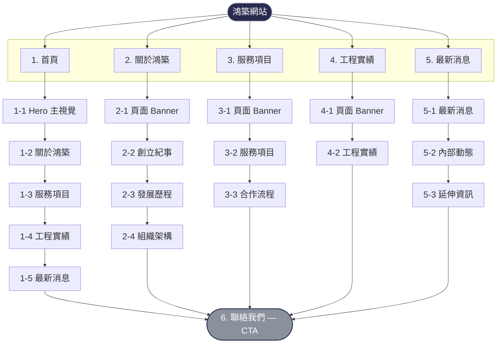

# 鴻築室內裝修網站提案簡報

副標：`FP Decoration` 官方形象網站

---

## 1. 專案目標

- 建立「專業、穩重、值得信賴」的品牌網站形象
- 以清楚的服務與實績內容，提升潛在客戶詢問意願
- 讓訪客能快速理解公司優勢、合作流程與聯絡方式

---

## 2. 目前提案範圍（Webite）

**五個主要頁面**（5 支 HTML）；**聯絡我們**非獨立第 6 頁，而是各頁底部共用的 **Contact / `#contact` CTA 區塊**（內容與表單一致）。

- 首頁：`index.html`（1-1～1-6 六個捲動區）
- 關於鴻築：`about.html`
- 服務項目：`services.html`
- 工程實績：`portfolio.html`
- 最新消息：`news.html`

本次提案重點為資訊架構、視覺風格與內容呈現方式。

---

## 3. 品牌視覺方向

- **基調**：深藍與銀色金屬搭配，傳達專業、精緻與品質感
- **風格**：留白、線性結構、精緻網格，強化建築／工程語彙
- **語氣**：理性、穩健、具執行力

**現行品牌色系**

| 變數              | Hex       | 用途                              |
| ----------------- | --------- | --------------------------------- |
| `--navy`          | `#292a50` | 主色：nav、hero、footer、深色背景 |
| `--navy-mid`      | `#263561` | 輔色：hero accent                 |
| `--navy-light`    | `#37569a` | 輔色：裝飾細節                    |
| `--silver`        | `#8a919c` | 強調色：按鈕、eyebrow、數字編號   |
| `--silver-light`  | `#c8ced6` | 強調色：hover、active、標題 span  |
| `--silver-bright` | `#e8ecf0` | 分隔線漸層亮部                    |
| `--silver-dark`   | `#6a717c` | 分隔線漸層暗部                    |
| `--cream`         | `#f7f5f0` | 背景：section 交替色              |
| `--text-dark`     | `#1a1a1a` | 主文字                            |
| `--text-mid`      | `#4a4a4a` | 內文段落                          |
| `--text-light`    | `#696a6d` | 次要說明、標籤                    |

建議後續可正式定義品牌色票（含主色、輔色、互動色、警示色）與元件規範。

---

## 4. 資訊架構（IA）

全站 **5 個頁面**（5 支 HTML）。導覽列對應首頁與四內頁；**聯絡我們**為各頁底部同一套 **CTA / `#contact`**（非獨立網址）。

導覽列包含 **6 個連結**（首頁、關於鴻築、服務項目、工程實績、最新消息、聯絡我們），右側另設**繁中 ｜ EN 語系切換**（英文版 `en/` 目錄架構已預備，為後續開發項目）。

1. **首頁**（`index.html`）：1-1～1-6
2. **關於鴻築**（`about.html`）：2-1～2-5
3. **服務項目**（`services.html`）：3-1～3-4
4. **工程實績**（`portfolio.html`）：4-1～4-3
5. **最新消息**（`news.html`）：5-1～5-4

※ 各頁之「聯絡我們（CTA）」為共用區塊，與首頁 1-6 為同一聯絡架構。

### 網站 Sitemap（架構圖）

---

## 5. 首頁提案重點

- Hero 主視覺（含背景圖 `images/home-hero.png`）：快速建立品牌第一印象
- About / Services / Portfolio / News Preview：完整導覽主線
- 各區塊皆有「繼續閱讀」或導向內頁的入口（了解更多 / 查看全部實績 / 查看全部消息）
- 首頁任務：把陌生訪客導向「看懂服務 + 看見實績 + 留下聯絡」

---

## 6. 關於鴻築頁提案

- 頁面頂部設有 **Banner（page-hero）**，與其他子頁格式一致
- 內容結構：創立紀事（圖文並排，含情境照片）→ 發展歷程（時間軸）→ 組織架構（五部門卡片）
- 以圖文與時間軸呈現發展脈絡，降低閱讀門檻
- 強化品牌故事深度，提升信任感

建議加值：可補上關鍵證照、合作品牌、代表客戶 Logo 牆。

---

## 7. 服務項目頁提案

- 頁面頂部設有 **Banner（page-hero）**
- 六大服務卡片：內容清楚、易掃讀
- 「合作流程四步驟」：需求洽談 → 規劃設計 → 施工執行 → 驗收交付，補強客戶決策所需資訊
- 頁面目標：讓客戶知道「你們做什麼、怎麼做、做得多完整」

建議加值：可加入「適合案件類型」與「常見預算級距」區塊。

---

## 8. 工程實績頁提案

- 頁面頂部設有 **Banner（page-hero）**
- 以案例卡片呈現不同場域（購物中心、酒店旅館、百貨公司、住宅公設、複合式商業）
- 圖片置於 `images/profolios/` 目錄，上線前建議將檔案依案例類型重新命名（現有檔名皆為 `hotel-*`，與實際案例類型不符）
- 頁面目標：用作品證明能力，支撐詢問決策

建議加值：每個案例補充「坪數 / 工期 / 服務內容 / 完工年份」；加入首頁已有的「查看全部實績」導覽按鈕。

---

## 9. 最新消息頁提案

- 頁面頂部設有 **Banner（page-hero）**
- 公司動態：工程進度與品牌更新
- 員工活動：組織文化與人才形象
- 友站連結：合作生態與產業資源（合作夥伴 / 產業資源 兩欄）

建議加值：可整合為「文章列表 + 分類標籤 + 單篇頁」形式。

---

## 10. 聯絡轉換設計（全站）

- 每頁保留聯絡區塊（地址、電話、Email、表單），圖示採 SVG 外部檔（`images/address.svg` 等）
- 主要 CTA 一致化：送出詢問
- 目標：降低跳出、縮短從瀏覽到詢問的路徑

建議加值：串接表單通知（Email / CRM / Google Sheet）。

---

## 11. 技術與維運建議

- 建置方式：使用 Bluehost 主機 + WordPress + Breakdance 製作網站。版面與內容分開管理，日後新增/修改內容不需要改動整體設計，維護更方便。
- 內容更新（客戶可自行操作）：
  - 最新消息：提供後台「新增文章」的方式更新，會自動套用一致的版面與排版
  - 工程實績：可做成「案例管理」的形式，之後只要新增案例內容，就能自動出現在案例列表中（不必每次都重排整頁）
- SEO 與成效追蹤（可讓客戶更容易被找到、也看得到成果）：
  - 每個頁面都能設定：標題、簡介（搜尋結果摘要）、分享圖片等，並自動產出網站地圖，協助搜尋引擎收錄
  - 串接 Google Analytics（GA4），可追蹤「送出詢問」等重要行為，方便後續行銷投放與成效回報
- 表單與通知：聯絡表單送出後可寄到指定信箱（可設定多人收件/備援），也可選配串接 Google Sheet 或 CRM，方便後續跟進
- 英文版（多語）：以同一套網站架構管理中英文內容，避免做兩套網站導致維護成本加倍；也能確保中英文切換一致、對搜尋更友善
- 維運與安全：
  - 提供「先在測試環境確認、再更新到正式站」的流程，降低更新造成網站異常的風險
  - 啟用自動備份（網站檔案＋資料），必要時可快速還原
  - 進行圖片最佳化與快取設定，提升載入速度與手機瀏覽體驗

---

## 12. 執行時程（建議）

### Phase 1：提案確認（1 週）

- 確認 IA、頁面重點、文案方向

### Phase 2：視覺定稿（1–2 週）

- UI 視覺稿、元件規範、圖片風格
- 確認品牌色票與銀色系輔色應用規範

### Phase 3：前端實作（1–2 週）

- 響應式調整、互動與效能優化
- 圖片命名整理（portfolio 目錄）

### Phase 4：上線與驗收（1 週）

- 測試、部署、交接與教學

---

## 13. 交付項目（建議）

- WordPress 網站建置（Bluehost 環境部署、正式站上線設定）
- Breakdance 版型與頁面完成（首頁／關於／服務／工程實績／最新消息／聯絡區塊）
- 後台內容管理架構（最新消息可自行新增更新；工程實績可持續新增案例並顯示於列表）
- 基本 SEO 設定（各頁標題與搜尋摘要可編輯、網站地圖等）
- 成效追蹤設定（GA4 基本安裝、可追蹤表單送出等重點行為）
- 表單通知設定（收件信箱、備援收件人；選配：Google Sheet/CRM 串接）
- 視覺規範摘要（色彩、字體、元件）
- 維運交接與操作教學（內容更新流程、備份與更新注意事項）
- 內容維護建議文件

---

## 14. 下一步

- 確認本提案簡報方向與優先調整頁面
- 確認英文版（`en/`）的開發優先順序與時程
- 確認是否需要納入：
  - 後台 CMS
  - 案例詳情頁模板
  - 文章系統

確認後即可進入 UI 定稿與正式開發排程。
