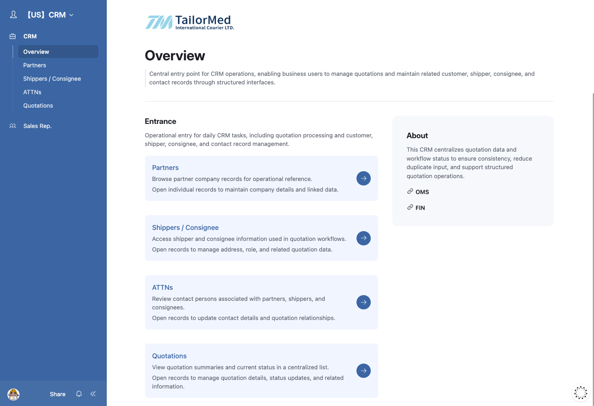
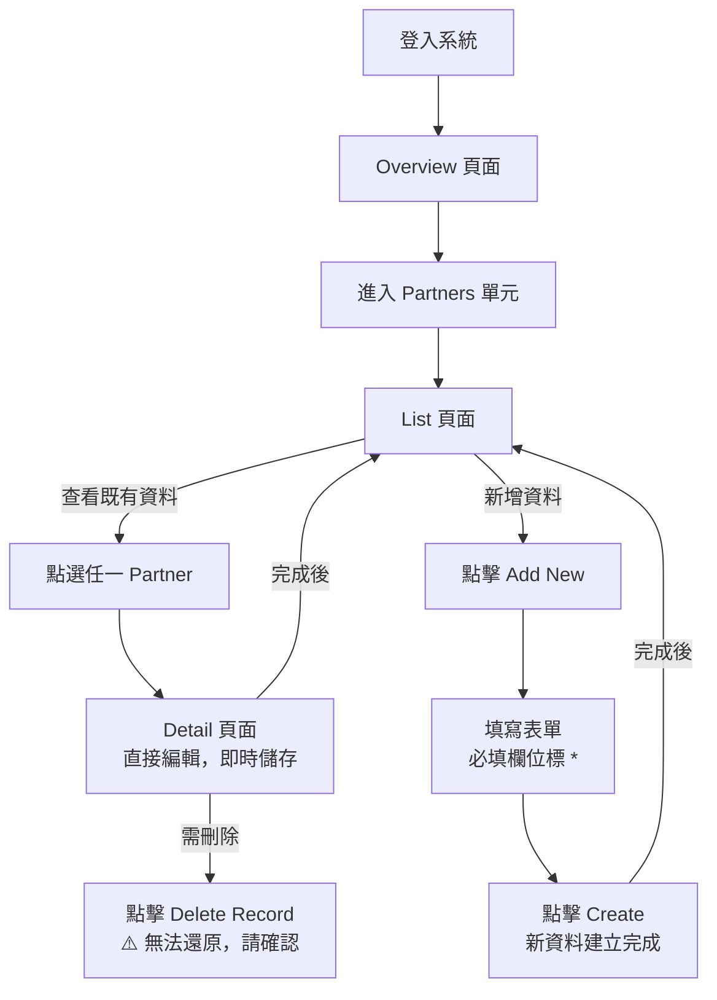

# TailorMed CRM 操作手冊

## Partner（合作夥伴）單元

> 本文件適用對象：業務新進人員
> 系統：TailorMed CRM（Airtable Interface）

---

## 一、系統入口：Overview

登入系統後，預設會進入 **Overview** 頁面。

此頁面是整個 CRM 的入口總覽，畫面中會顯示各單元的說明卡片，點擊卡片右側的箭頭按鈕即可直接前往對應單元。

左側導覽列（側邊欄）列出所有可切換的功能單元：

- Partners
- Shippers / Consignee
- ATTNs
- Quotations

> 💡 你也可以隨時透過左側導覽列在各單元之間切換，不需要回到 Overview。

---

## 二、Partners 單元概覽

**Partners** 是用來管理客戶公司及代理商（Agent）基本資料的單元。

進入 Partners 單元後，系統會先顯示 **List 頁面**（列表），呈現資料庫中目前所有已建立的合作夥伴資料。

### 列表欄位說明

| 欄位                | 說明         |
| ------------------- | ------------ |
| Partners（Logo）    | 公司識別圖示 |
| Partner Name        | 公司簡稱     |
| Full Name           | 公司全名     |
| Address             | 公司地址     |
| Tax ID / VAT Number | 稅務編號     |
| Primary Contact     | 主要聯絡人   |

> 列表依 **Role（角色）** 分組，目前主要分為 **Client** 與 **Agent** 兩類。

---

## 三、新增 Partner 資料

### 步驟

1. 在 List 頁面右上角，點擊 **[Add New]** 按鈕
2. 畫面右側會彈出 **New Partner** 表單
3. 依序填寫各欄位（標示 **紅色 \*** 號者為**必填**）
4. 確認資料無誤後，點擊右下角的 **[Create]** 按鈕完成建立

### 表單欄位說明

#### Basic（基本資訊）

| 欄位           | 是否必填 | 說明                                            |
| -------------- | -------- | ----------------------------------------------- |
| Partner Name   | ✅ 必填  | 公司簡稱，用於系統辨識                          |
| Full Name      | 選填     | 公司正式全名                                    |
| Profile Pic    | 選填     | 公司 Logo 圖片，可拖曳或點擊上傳                |
| City / Country | 選填     | 所在城市與國家                                  |
| Role           | 選填     | 預設為 **Client**，可依實際情況調整（如 Agent） |
| Active         | 選填     | 預設為 **Active**（啟用中）                     |
| Address        | ✅ 必填  | 公司完整地址                                    |
| Main Phone     | 選填     | 公司主要電話                                    |
| Main Email     | 選填     | 公司主要電子信箱                                |

#### Financial Info（財務資訊）

| 欄位                | 說明                 |
| ------------------- | -------------------- |
| Payment Terms       | 付款條件（下拉選單） |
| Closing Date        | 結帳日期（下拉選單） |
| Tax ID / VAT Number | 統一編號或稅務編號   |

#### Primary Contact - ATTNs（主要聯絡人）

| 欄位            | 說明                                                       |
| --------------- | ---------------------------------------------------------- |
| Primary Contact | 點擊 **[+ Add contact]** 可連結至對應的聯絡人資料（ATTNs） |

---

### ⚠️ 注意：表單暫存機制

New Partner 表單具有**自動暫存**功能：

- 若你填寫到一半，暫時切換去瀏覽 List 或 Detail 頁面，**表單內容不會消失**
- 只要回到 List 頁面再次點擊 **[Add New]**，先前填寫的內容就會自動恢復
- **例外**：若重新整理頁面或關閉瀏覽器分頁，暫存內容將會**遺失**，需重新填寫

---

## 四、查看與編輯 Partner 資料

### 開啟 Detail 頁面

在 List 頁面點擊任一筆資料列，即可開啟該筆 Partner 的 **Detail（詳細資料）** 頁面。

### Detail 頁面結構

頁面上方顯示該 Partner 的名稱，下方有數個**分頁頁籤**可快速切換：

- **Basic** — 基本聯絡資料
- **Financial Info** — 財務相關資訊
- **Related ATTNs** — 關聯的聯絡人
- **Related Quotations** — 關聯的報價單

> 點擊頁籤即可快速跳至對應的資訊區塊，不需要向下滾動。

### 編輯資料

- 直接點擊欄位即可進行編輯或補充
- **系統為即時儲存**，不需要另外按「存檔」
- 即使切換到其他 Partner 資料，剛才修改的內容也已自動儲存

### 層級說明

Detail 頁面的資訊具有層級結構：

- **第一層**：Partner Detail 本身，**可直接在此編輯**
- **第二層**：關聯資料（如 Related ATTNs 的聯絡人卡片），**僅供檢視**；若需修改或編輯，請前往對應的功能單元（如 ATTNs）進行操作

---

## 五、刪除 Partner 資料

每筆 Detail 頁面底部都有一個 **紅色 [Delete Record] 按鈕**。

> ⚠️ **刪除前請務必再次確認！**
> 資料一經刪除，**系統無法復原**，請謹慎操作。

---

## 六、常用操作流程小結

---

_文件版本：v1.0 | 適用系統：TailorMed CRM（US）_
