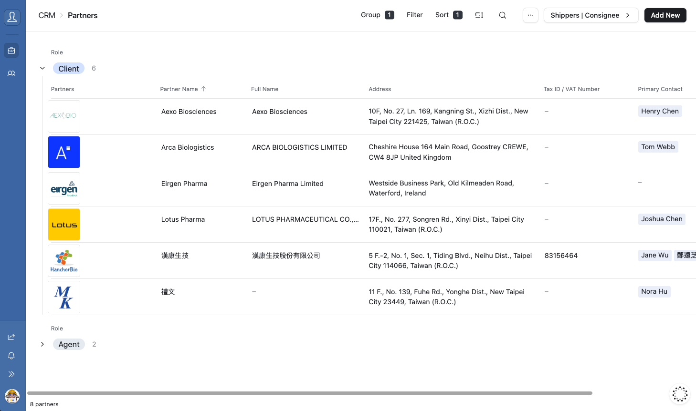
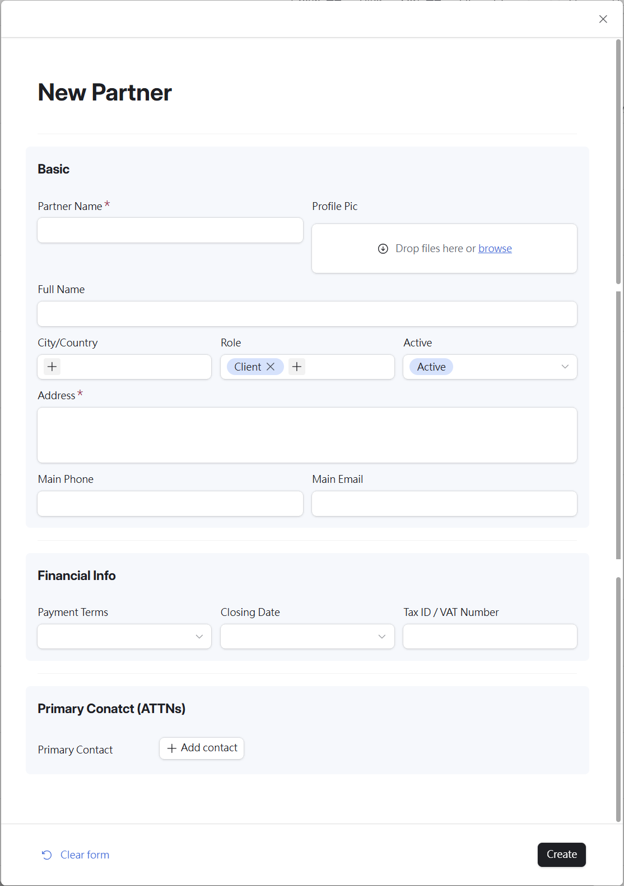
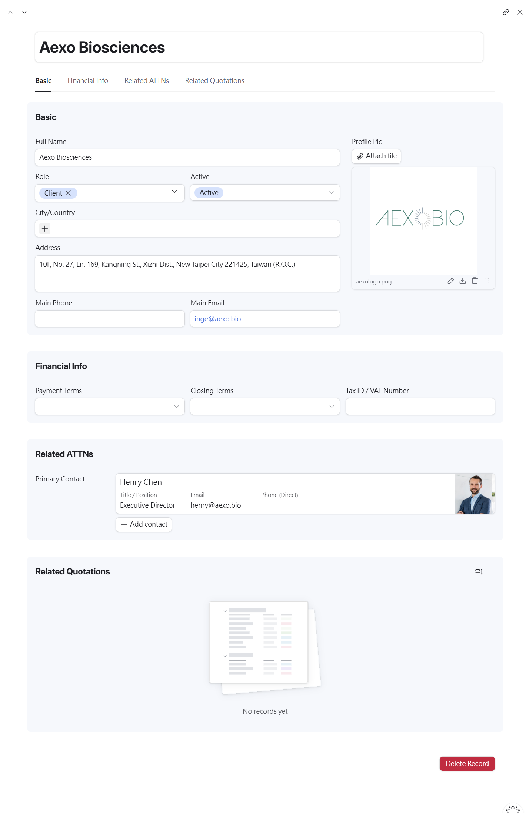
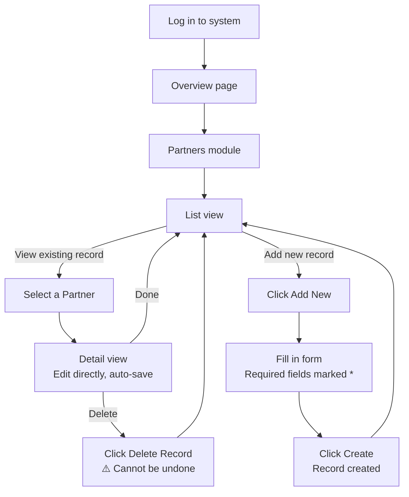

# Chapter 2 — Partners

---

## 2.1 Module Overview

The **Partners** module stores records for all client companies and agents. Each record holds basic company information, financial details, linked contacts (ATTNs), and related quotations.

---

## 2.2 Viewing the Partner List

Click **Partners** in the sidebar to open the list view. Records are grouped by **Role** — currently **Client** and **Agent**.

The list displays the following columns:

| Column              | Description                               |
| ------------------- | ----------------------------------------- |
| Partners (Logo)     | Company profile image                     |
| Partner Name        | Short name used for system identification |
| Full Name           | Official registered company name          |
| Address             | Company address                           |
| Tax ID / VAT Number | Tax registration number                   |
| Primary Contact     | Linked primary contact person             |

## 2.3 Adding a New Partner

1. Click the **[Add New]** button in the top-right corner of the list page.
2. The **New Partner** form will appear on the right side of the screen.
3. Fill in the required fields (marked with a **red \***).
4. Click **[Create]** at the bottom-right to save the record.

### Form Field Reference

**Basic Information**

| Field          | Required    | Notes                                                      |
| -------------- | ----------- | ---------------------------------------------------------- |
| Partner Name   | ✅ Required | Short name used for system identification                  |
| Full Name      | Optional    | Official registered company name                           |
| Profile Pic    | Optional    | Company logo — drag and drop or click Browse to upload     |
| City / Country | Optional    | Location of the company                                    |
| Role           | Optional    | Defaults to **Client** — change to **Agent** if applicable |
| Active         | Optional    | Defaults to **Active**                                     |
| Address        | ✅ Required | Full company address                                       |
| Main Phone     | Optional    | Primary company phone number                               |
| Main Email     | Optional    | Primary company email address                              |

**Financial Information**

| Field               | Notes                           |
| ------------------- | ------------------------------- |
| Payment Terms       | Select from dropdown            |
| Closing Date        | Select from dropdown            |
| Tax ID / VAT Number | Company tax registration number |

**Primary Contact (ATTNs)**

| Field           | Notes                                                     |
| --------------- | --------------------------------------------------------- |
| Primary Contact | Click **[+ Add contact]** to link an existing ATTN record |

### Form Auto-Save Behaviour

> ⚠️ **Note**
> If you navigate away mid-form (e.g. to check the list), your draft is preserved — clicking **[Add New]** again will restore your unsaved entries. However, **refreshing the page or closing the browser tab will permanently discard all unsaved input**.

---

## 2.4 Viewing & Editing a Partner Record

Click any row in the list to open the **Detail view**. All fields can be edited directly — changes are saved automatically in real time.

The Detail page has four tabs for quick navigation:

| Tab                    | Description                                                       |
| ---------------------- | ----------------------------------------------------------------- |
| **Basic**              | Core company and contact information                              |
| **Financial Info**     | Payment terms and tax details                                     |
| **Related ATTNs**      | Linked contact persons — read-only here; edit in the ATTNs module |
| **Related Quotations** | All quotations associated with this partner                       |

### Data Levels

The Detail page has two levels of content:

- **Level 1** — The Partner record itself. All fields are directly editable.
- **Level 2** — Linked records (e.g. Related ATTNs). These are read-only in this view. To edit them, navigate to the corresponding module (e.g. ATTNs) directly.

---

## 2.5 Deleting a Record

A red **[Delete Record]** button appears at the bottom of every Detail page.

> ⚠️ **Warning — Irreversible Action**
> Deleted records cannot be recovered. Always verify you have selected the correct record before clicking Delete.

---

## 2.6 Partners Workflow

---

_Document version: v1.0 | System: TailorMed [CRM] Interface_
