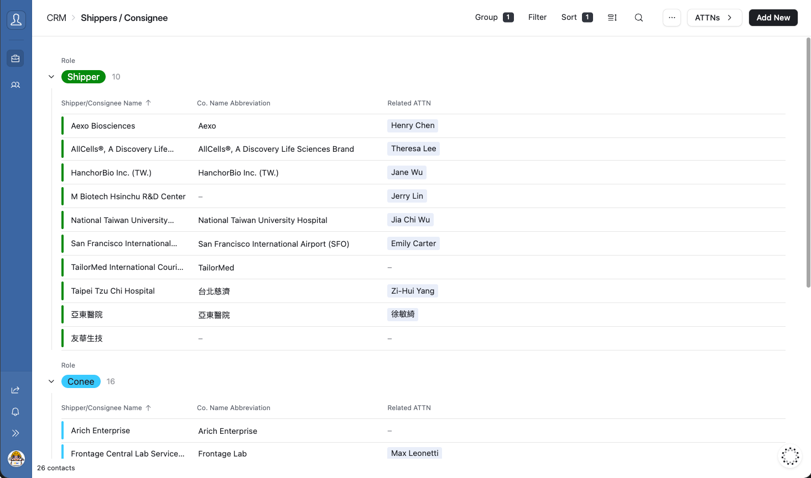
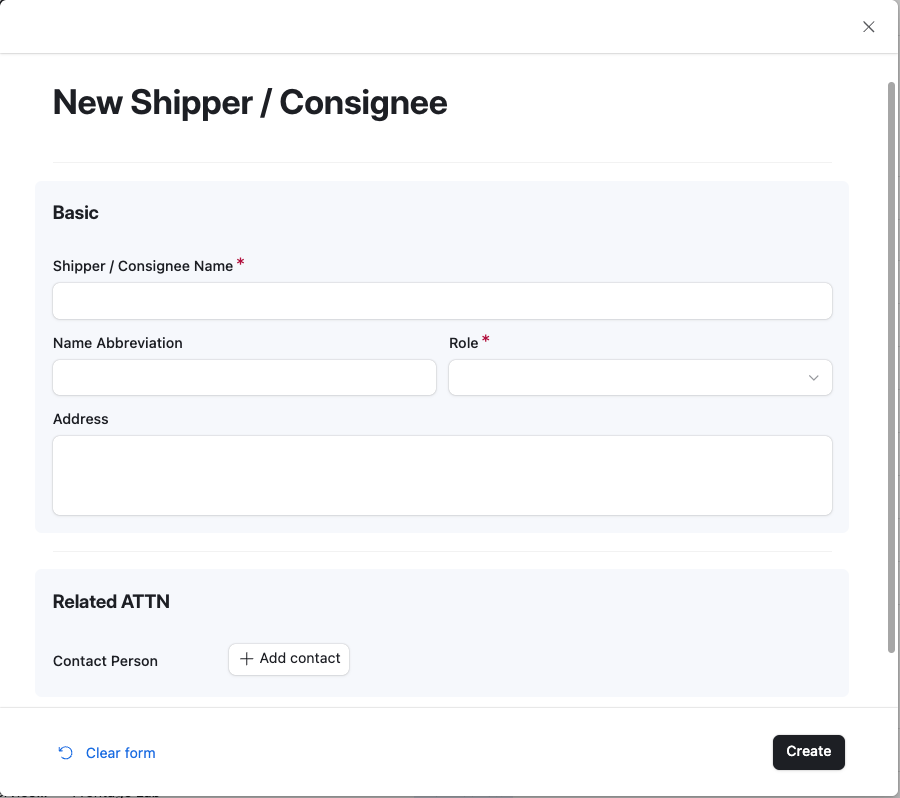
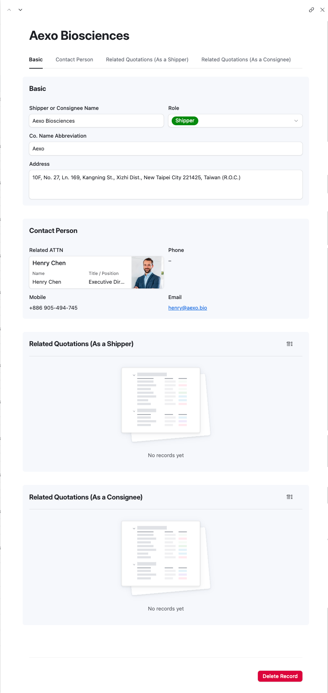
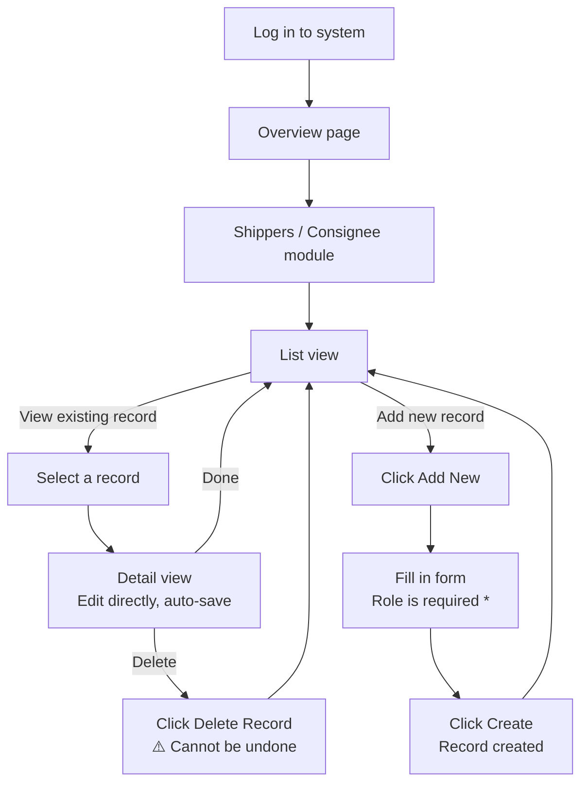

# Chapter 3 — Shippers / Consignee

> Module: Shippers / Consignee
> System: TailorMed CRM (Airtable Interface)

---

## 3.1 Module Overview

The **Shippers / Consignee** module stores the basic logistics information for pickup locations (Shippers) and delivery destinations (Consignees).

Each record must be assigned a **Role** — either **Shipper** or **Consignee** — to indicate how that party is involved in a shipment. Note that the same company can appear as both a Shipper and a Consignee depending on the shipment context.

---

## 3.2 Viewing the Shippers / Consignee List

Click **Shippers / Consignee** in the sidebar to open the list view. Records are grouped by **Role**:

- **Shipper** — pickup locations
- **Consignee** — delivery destinations

The list displays the following columns:

| Column                   | Description                    |
| ------------------------ | ------------------------------ |
| Shipper / Consignee Name | Full company name              |
| Co. Name Abbreviation    | Short name for quick reference |
| Related ATTN             | Linked contact person          |

---

## 3.3 Adding a New Shipper / Consignee

1. Click the **[Add New]** button in the top-right corner of the list page.
2. The **New Shipper / Consignee** form will appear.
3. Fill in the required fields (marked with a **red \***).
4. Click **[Create]** at the bottom-right to save the record.

### Form Field Reference

**Basic Information**

| Field                    | Required    | Notes                                                                                 |
| ------------------------ | ----------- | ------------------------------------------------------------------------------------- |
| Shipper / Consignee Name | ✅ Required | Full company name                                                                     |
| Name Abbreviation        | Optional    | Short name for quick reference                                                        |
| Role                     | ✅ Required | Select **Shipper** or **Consignee**                                                   |
| Address                  | Optional    | Full address of the pickup or delivery location. Recommended to fill in for accuracy. |

**Related ATTN**

| Field          | Required | Notes                                                     |
| -------------- | -------- | --------------------------------------------------------- |
| Contact Person | Optional | Click **[+ Add contact]** to link an existing ATTN record |

> 💡 **Note** — The same company can act as both a Shipper and a Consignee depending on the shipment. If this applies, create a separate record for each role so that quotation links remain accurate and easy to trace.

---

## 3.4 Viewing & Editing a Record

Click any row in the list to open the **Detail view**. All fields can be edited directly — changes are saved automatically in real time.

The Detail page has four tabs:

| Tab                                     | Description                                                    |
| --------------------------------------- | -------------------------------------------------------------- |
| **Basic**                               | Core logistics information — name, role, address               |
| **Contact Person**                      | Linked ATTN contact — read-only here; edit in the ATTNs module |
| **Related Quotations (As a Shipper)**   | All quotations where this record is the pickup party           |
| **Related Quotations (As a Consignee)** | All quotations where this record is the delivery party         |

> 💡 **Tip** — The Related Quotations tabs are automatically populated by Airtable. They allow you to quickly see all shipments associated with this location, whether as a pickup or delivery party.

---

## 3.5 Deleting a Record

A red **[Delete Record]** button appears at the bottom of every Detail page.

> ⚠️ **Warning — Irreversible Action**
> Deleted records cannot be recovered. Always verify you have selected the correct record before clicking Delete.

---

## 3.6 Shippers / Consignee Workflow

