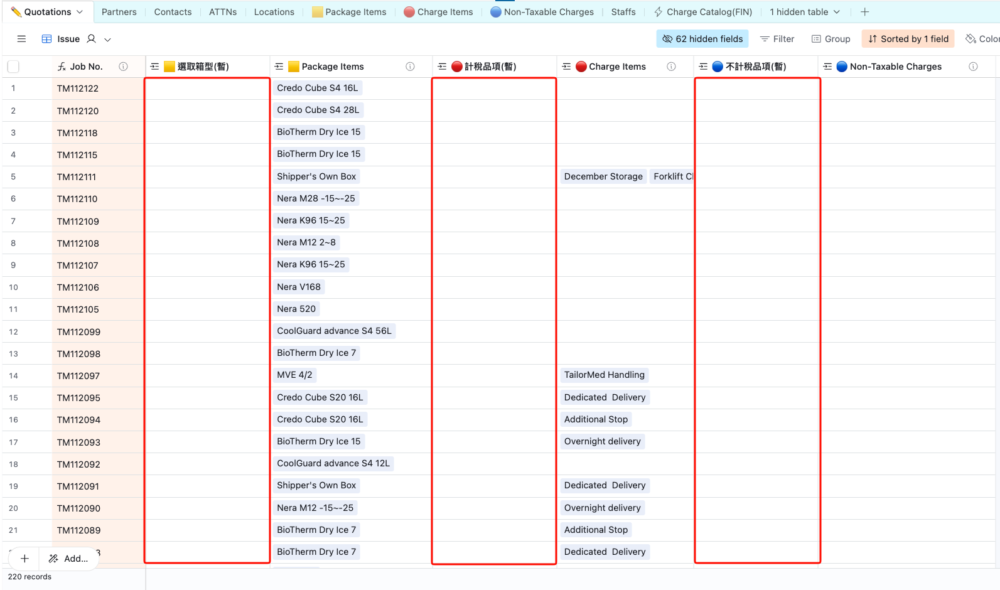
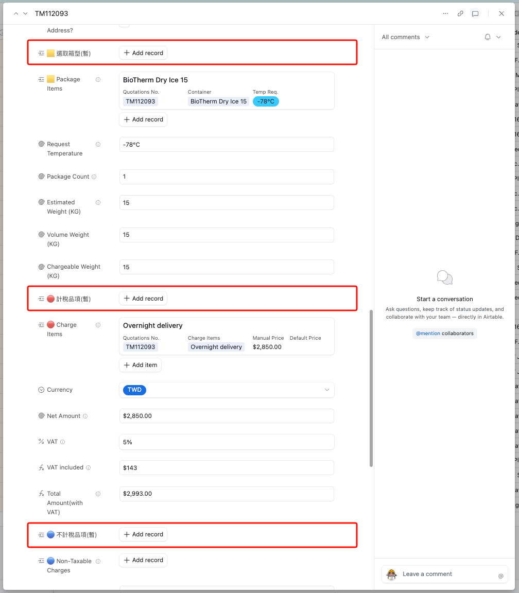

# Airtable 自動化操作手冊

> **文件版本**：v1.1  
> **建立日期**：2026-02-08  
> **最後更新**：2026-03-04  
> **維護者**：萬能數維  
> **適用對象**：報價單操作人員、新進人員、系統管理員

---

## 一、文件定位與目的

本手冊用於說明 Airtable 報價系統中「主表 × 子表 × 自動化」的正確操作方式，  
協助操作人員在日常填單時避免資料錯誤，並在異常時能正確回報。

本文件**不是**系統開發教學，亦不包含以下內容：

- Automation 設定畫面逐步教學
- Script 程式邏輯修改教學
- 欄位架構重設與資料模型改造

如需調整系統邏輯（觸發條件、欄位關聯、分群規則），請由管理員另案評估。

---

## 二、系統架構概覽

本系統涉及四張主要資料表：

| 表單名稱               | 說明                                   |
| ---------------------- | -------------------------------------- |
| ✏️ Quotations Table    | 報價單主表，操作人員的唯一主要作業介面 |
| 🟨 Package Items       | 包材項目明細表（子表）                 |
| 🔴 Charge Items        | 計費項目明細表（子表）                 |
| 🔵 Non-Taxable Charges | 免稅項目明細表（子表）                 |

核心原則：

- 操作人員只在主表操作及填寫
- 三張子表由系統自動建立、分群、清理

### 2.1 主表與子表角色

- **主表（✏️ Quotations）**
  - 業務層級資料入口
  - 填寫 Job No.、Partner、Status 等欄位
- **子表（🟨 Package Items / 🔴 Charge Items / 🔵 Non-Taxable Charges）**
  - 由系統依主表操作自動產生
  - 不建議手動新增或修改連結關係

### 2.2 暫存欄位（Temp）機制

主表中標示 `(暫)` 的欄位（如：`🟨 選取箱型(暫)`）僅用於觸發自動化：

1. 使用者選取品項
2. 系統建立並分群子表資料（依 Job No.）
3. 系統自動清空 `(暫)` 欄位

`(暫)` 欄位不保留最終資料，屬於觸發型欄位。

_圖 1：紅框處為在✏️ Quotations 資料表中可填入包材、計稅品項及免稅項目之欄位(觸發欄)。_

_圖 2：紅框處為單一資料展開後，可填入包材、計稅品項及免稅項目之欄位(觸發欄)。_

## 三、自動化說明

### 3.1 Item Table Auto Grouping（🟨🔴🔵）

| 項目     | 內容                     |
| -------- | ------------------------ |
| 觸發條件 | 主表記錄符合分群條件     |
| 執行方式 | Airtable Script 自動執行 |
| 狀態     | ON（啟用中）             |

功能說明：

- 依主表輸入，自動將資料寫入對應之子表
- 建立正確主、子表關聯
- 避免手動搬資料造成錯誤

### 3.2 Auto Remove Orphan Items（子表各一支）

對應三張子表：

- Auto Remove Orphan items in 🟨 Package Items
- Auto Remove Orphan items in 🔴 Charge Items
- Auto Remove Orphan items in 🔵 Non-Taxable Charges

| 項目     | 內容                     |
| -------- | ------------------------ |
| 觸發條件 | 子表記錄進入指定 View    |
| 執行方式 | Airtable Script 自動執行 |
| 狀態     | ON（啟用中）             |

功能說明：

- 清理未與任何主表記錄關聯之孤立項（Orphan Items）
- 防止資料膨脹、降低錯誤累積

---

## 四、正確操作流程（建議唯一操作方式）

### 4.1 建立新單 SOP

1. 在主表新增一筆**空白資料**
2. 填入全新且未使用過的 Job No.（不可 Duplicate）
3. 填寫 Partner / Shipper / Consignee 等基本欄位
4. 於 `(暫)` 欄位選取所需品項
5. 等待系統自動化執行（約 1～2 秒）
6. 確認：
   - `(暫)` 欄位已清空
   - 對應子表資料已建立且依 Job No. 分群
7. 展開此單，並於該自動加入品項內，填寫相應之數值及內容

### 4.2 子表可人工補充範圍（僅限）

可填寫：

- Quantity（數量）
- Weight（重量）
- Manual Price（手動價格）
- Item Description、Batch/Lot Number 等品項明細欄位

不可操作：

- 新增子表資料
- 修改子表連結欄位
- 直接修正 Unnamed record

---

## 五、嚴格禁止事項

### 5.1 禁止使用 Duplicate 建立新單(新的 Quotation)

Duplicate 會複製舊連結與舊品項關係，常導致：

- 舊單號殘留
- 子表關聯錯位
- 品項共用與重複計價風險

### 5.2 禁止直接操作子表連結

請勿：

- 手動新增子表記錄
- 修改子表連結欄位
- 嘗試人工修復 Unnamed record

## 六、常見異常與處理方式

### Q1：子表出現 Unnamed record

常見原因：

- 使用 Duplicate
- 人工改動子表連結欄位

建議處理：

1. 重新建立新單
2. 回主表重選 `(暫)` 欄位品項
3. 必要時使用 Record Template

### Q2：子表有多餘項目，但主表沒有

可能為孤立項，系統會在觸發時自動清理。  
請勿手動刪除或重接連結。

### Q3：主表已修改，子表未立即更新

自動化可能需數秒至數十秒。

---

## 七、操作原則總結

- 不 Duplicate Record
- 只操作主表(✏️ Quotations)
- 只用 ✏️ Quotations中有 `(暫)` 欄位觸發分群
- 子表交由系統處理

---

## 九、技術背景（管理員參考）

上述四項自動化使用 Airtable Script 實作：

| 自動化名稱                   | Script 邏輯摘要                            |
| ---------------------------- | ------------------------------------------ |
| Item Table Auto Grouping     | 讀取主表內容後，分類寫入三張子表並建立關聯 |
| Auto Remove Orphan Items × 3 | 掃描子表中未關聯記錄並自動刪除             |

> Script 修改需具 JavaScript 能力，請勿直接進行程式碼內容的修改。

---

## 十、異動紀錄

| 日期       | 版本 | 修改內容               | 修改者   |
| ---------- | ---- | ---------------------- | -------- |
| 2026-03-04 | v1.1 | 合併內容並重整章節結構 | 萬能數維 |
| 2026-02-08 | v1.0 | 初版建立               | 萬能數維 |

---

_本文件如有更新，請通知相關操作人員。_
