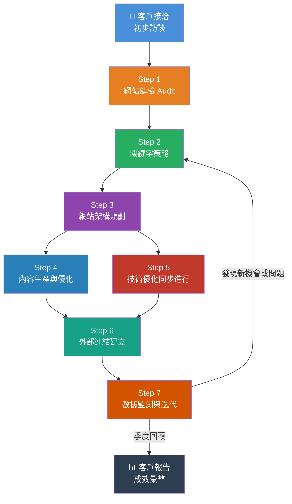

# SEO 標準作業流程（SOP）總覽
### 版本：v1.0 ｜ 更新日期：2026-04 ｜ 適用對象：接案 SEO 顧問

---

## 一、為什麼現在更需要系統化 SOP？

2026 年，生成式 AI（ChatGPT、Gemini、Perplexity）已深度改變搜尋行為。**GEO（Generative Engine Optimization）**的崛起代表：

- 使用者開始在 AI 問答中取得資訊，而非只點擊藍色連結
- Google 的 AI Overviews（原 SGE）在 SERP 占據更多版面
- 傳統 SEO 流量面臨「零點擊搜尋」壓力持續增加
- **品牌可信度、內容深度、結構化資料** 成為被 AI 引用的關鍵因素

> **SEO 顧問的核心價值不再只是排名，而是確保品牌在「有人問問題」時，出現在答案裡。**

---

## 二、SEO 四大面向（2026 版）

```
┌─────────────────────────────────────────────────────────────────┐
│                     SEO 四大面向體系                               │
├──────────────┬──────────────┬──────────────┬────────────────────┤
│  技術 SEO     │  關鍵字策略   │  內容優化     │  站外優化           │
│  Technical   │  Keyword     │  Content     │  Off-Page          │
├──────────────┼──────────────┼──────────────┼────────────────────┤
│ • 爬取與索引  │ • 搜尋意圖    │ • E-E-A-T    │ • 反向連結品質      │
│ • Core Web   │ • 語意叢集    │ • 主題權威    │ • 品牌提及(NAP)    │
│   Vitals     │ • 長尾與問句  │ • 內容新鮮度  │ • 數位 PR          │
│ • 結構化資料  │ • AI 搜尋    │ • 多模態內容  │ • GEO 引用建立     │
│ • 行動版優化  │   關鍵字     │   (影音/圖)  │ • 社群信號         │
│ • 國際化     │ • 競爭分析    │ • EEAT 強化  │ • 合作夥伴生態     │
└──────────────┴──────────────┴──────────────┴────────────────────┘
```

### 2.1 技術 SEO（Technical）

確保搜尋引擎能**正確爬取、索引、理解**網站內容。2026 年新增重點：

- **INP（Interaction to Next Paint）** 取代 FID，成為 Core Web Vitals 評分指標
- **結構化資料（Schema.org）** 是被 AI 引用的入場券
- **JavaScript 渲染策略**：SSR / SSG / Hybrid 對 Googlebot 的影響
- **Log File 分析**：確認 Googlebot 爬取預算分配是否合理

### 2.2 關鍵字策略（Keyword）

從「排名某個詞」進化為**「主題覆蓋與搜尋意圖滿足」**：

- **Topical Authority（主題權威）**：圍繞核心主題建立完整內容地圖
- **AI 搜尋關鍵字**：以問句、對話式語句為中心規劃
- **SERP Feature 攻略**：Featured Snippet、People Also Ask、知識圖譜
- **競爭缺口分析**：找出競品沒做好但有搜尋量的主題

### 2.3 內容優化（Content）

Google E-E-A-T（Experience, Expertise, Authoritativeness, Trustworthiness）在 2026 年更加關鍵：

- 作者資訊頁、引用來源、更新日期都影響 E-E-A-T 評分
- **內容深度 > 內容數量**：一篇 3,000 字的深度文勝過十篇 300 字的淺文
- **多模態內容**：圖表、影片、互動式工具提升停留時間與引用可能性
- **AI 生成內容策略**：需有人工審核、個人觀點注入，避免「有用性更新」懲罰

### 2.4 站外優化（Off-Page）

超越傳統反向連結，進化為**品牌信號與數位公關**：

- **Unlinked Brand Mentions**：即使沒有連結，品牌提及也是信號
- **GEO 引用建立**：讓品牌出現在 Wikipedia、業界報告、媒體文章，提升被 AI 引用機率
- **本地 SEO（NAP 一致性）**：Google Business Profile 深度優化
- **數位 PR**：與媒體、KOL、產業報告合作

---

## 三、完整執行流程總覽



---

## 四、各 Step 文件對應索引

| 編號 | 文件名稱 | 說明 |
|------|----------|------|
| 00 | 總覽與四大面向（本文） | SOP 架構說明 |
| 01 | 客戶訪談記錄範本 | 接案前必備訪談表單 |
| 02 | Step 1 網站健檢 | Audit 流程與記錄表 |
| 03 | Step 2 關鍵字策略 | 關鍵字研究流程與交付文件 |
| 04 | Step 3 網站架構規劃 | IA 規劃流程與審核表 |
| 05 | Step 4 內容生產優化 | 內容策略、排程、品質檢核 |
| 06 | Step 5 技術優化 | 技術清單與優先級排序 |
| 07 | Step 6 外部連結建立 | Link Building 策略與追蹤表 |
| 08 | Step 7 數據監測迭代 | KPI 設定、報告範本、迭代機制 |
| 09 | 2026 報價說明 | 服務項目與費用參考 |

---

## 五、2026 年接案的核心心態轉變

> **從「SEO 執行者」→「品牌數位能見度顧問」**

過去 SEO 顧問的交付物是「關鍵字排名報告」。
現在，你交付的是：

1. **有機搜尋流量成長趨勢**（質量並重）
2. **品牌在 AI 搜尋中的被引用頻率**
3. **內容資產的長期複利效益**
4. **技術健康度分數持續改善**

客戶看到的不只是排名，而是**整體數位品牌的競爭力提升**。

---

*文件系列：SEO SOP 2026 ｜ 下一份：[01_客戶訪談記錄範本.md](./01_客戶訪談記錄範本.md)*
