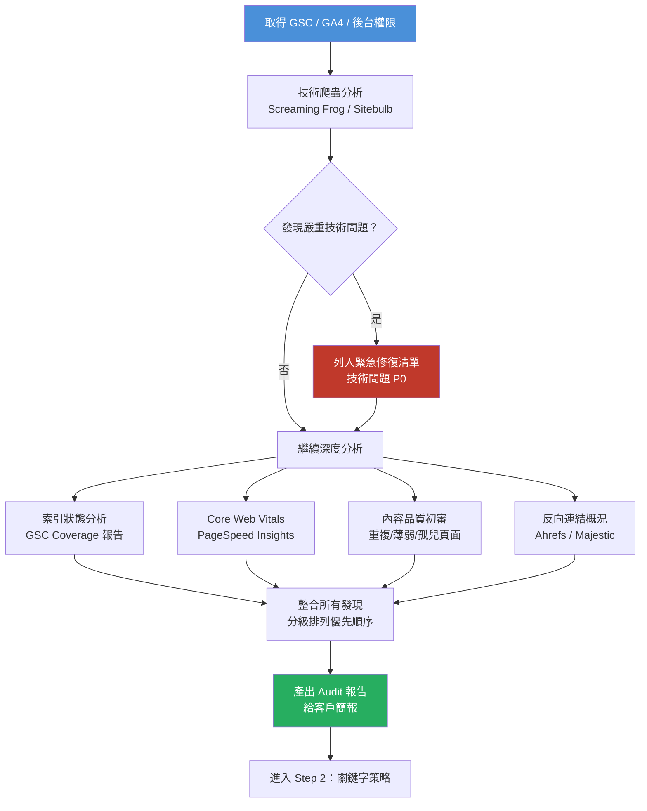

# Step 1｜網站健檢（SEO Audit）

> **目標**：找出網站在技術、內容、站外三個層面的問題，建立優先修復清單，作為後續所有 SEO 工作的基礎。

---

## 流程圖



---

## 工具清單

| 工具 | 用途 | 費用類型 |
|------|------|---------|
| Google Search Console | 索引狀態、Search Performance、Core Web Vitals | 免費 |
| Google Analytics 4 | 流量來源、行為分析、轉換追蹤 | 免費 |
| Screaming Frog SEO Spider | 全站爬蟲、技術問題掃描 | 免費版限 500 URLs；付費版 £259/年 |
| PageSpeed Insights / Lighthouse | Core Web Vitals 詳細報告 | 免費 |
| Ahrefs / Semrush | 反向連結分析、關鍵字排名 | 付費（含在報價成本內） |
| Sitebulb | 視覺化爬蟲分析、Log File | 付費 $13.99/月起 |
| Screaming Frog Log File Analyser | 分析 Googlebot 爬取行為 | 付費（搭配 SF 授權） |

---

## 一、技術健檢清單

### 1.1 爬取與索引

| 檢查項目 | 狀態 | 備註 |
|---------|------|------|
| robots.txt 設定是否正確（無誤封鎖） | ☐ 正常  ☐ 異常 | |
| XML Sitemap 是否存在且已提交至 GSC | ☐ 正常  ☐ 異常 | |
| Sitemap 內是否包含 noindex 或重定向頁面 | ☐ 正常  ☐ 異常 | |
| GSC Coverage 報告：排除頁面數量是否異常 | ☐ 正常  ☐ 異常 | 數量：____ |
| Canonical 設定是否正確（無循環、無衝突） | ☐ 正常  ☐ 異常 | |
| HTTPS 是否全站啟用且正確重定向 | ☐ 正常  ☐ 異常 | |
| www / non-www 是否有統一並 301 重定向 | ☐ 正常  ☐ 異常 | |
| URL 結構是否簡潔、語意化（無特殊字元） | ☐ 正常  ☐ 異常 | |
| 重定向鏈（Redirect Chain）是否存在 | ☐ 正常  ☐ 有問題 | 數量：____ |
| 404 頁面數量是否過多 | ☐ 正常  ☐ 有問題 | 數量：____ |
| JavaScript 渲染頁面是否可被 Googlebot 正確讀取 | ☐ 正常  ☐ 需確認 | |

---

### 1.2 Core Web Vitals（2026 指標）

| 指標 | 說明 | 目前數值 | 目標 | 狀態 |
|------|------|---------|------|------|
| LCP（Largest Contentful Paint） | 最大內容元素載入時間 | ___ 秒 | < 2.5 秒 | ☐ 好  ☐ 差 |
| INP（Interaction to Next Paint） | 互動回應時間（2024 取代 FID） | ___ ms | < 200 ms | ☐ 好  ☐ 差 |
| CLS（Cumulative Layout Shift） | 視覺穩定性 | ___ | < 0.1 | ☐ 好  ☐ 差 |
| TTFB（Time to First Byte） | 伺服器回應速度 | ___ ms | < 600 ms | ☐ 好  ☐ 差 |
| 行動版整體評分（PageSpeed） | | ___ / 100 | > 70 | ☐ 好  ☐ 差 |
| 桌面版整體評分（PageSpeed） | | ___ / 100 | > 85 | ☐ 好  ☐ 差 |

---

### 1.3 On-Page 技術元素

| 檢查項目 | 數量/狀態 | 備註 |
|---------|---------|------|
| 缺少 Title Tag 的頁面 | ____ 頁 | |
| 重複 Title Tag | ____ 組 | |
| Title 超過 60 字元或過短（< 30 字元） | ____ 頁 | |
| 缺少 Meta Description 的頁面 | ____ 頁 | |
| 重複 Meta Description | ____ 組 | |
| H1 缺失或多個 H1 的頁面 | ____ 頁 | |
| 圖片缺少 Alt Text | ____ 張 | |
| 過大圖片（> 200KB 未壓縮） | ____ 張 | |
| 內部連結孤兒頁面（Orphan Pages） | ____ 頁 | |
| 破損內部連結（Internal Broken Links） | ____ 個 | |

---

### 1.4 結構化資料（Schema.org）

| Schema 類型 | 是否存在 | 驗證狀態 | 建議 |
|------------|---------|---------|------|
| Organization / LocalBusiness | ☐ 有  ☐ 無 | | |
| WebSite + SearchAction（站內搜尋） | ☐ 有  ☐ 無 | | |
| BreadcrumbList | ☐ 有  ☐ 無 | | |
| Article / BlogPosting | ☐ 有  ☐ 無 | | |
| Product + Review（若電商） | ☐ 有  ☐ 無 | | |
| FAQ | ☐ 有  ☐ 無 | | |
| HowTo | ☐ 有  ☐ 無 | | |

> **2026 GEO 重點**：結構化資料是 AI 搜尋引擎理解並引用內容的關鍵，缺少等同於放棄 AI 引用機會。

---

## 二、內容品質初審

### 2.1 內容問題掃描

| 問題類型 | 頁面數 | 範例 URL | 建議動作 |
|---------|-------|---------|---------|
| 薄弱內容（< 300 字） | | | 擴充或合併 |
| 重複內容（內部） | | | 設定 Canonical |
| 近似重複內容 | | | 整合或差異化 |
| 過時內容（>2 年未更新） | | | 更新或撤除 |
| 無流量且無排名頁面 | | | 評估去留 |
| 薄弱/缺乏 E-E-A-T 信號 | | | 加強作者資訊 |

---

### 2.2 現有自然搜尋表現（GSC 數據）

> 分析期間：過去 12 個月

| 指標 | 數值 |
|------|------|
| 總點擊數（Clicks） | |
| 總曝光數（Impressions） | |
| 平均 CTR | |
| 平均排名位置 | |
| 排名前 10 的關鍵字數 | |
| 排名 11-20（等待區）關鍵字數 | |

**流量最高的 5 個頁面：**

| 排名 | URL | 點擊數 | 主要關鍵字 |
|------|-----|-------|----------|
| 1 | | | |
| 2 | | | |
| 3 | | | |
| 4 | | | |
| 5 | | | |

---

## 三、反向連結概況

| 指標 | 數值 | 說明 |
|------|------|------|
| 總反向連結數（Backlinks） | | |
| 總域名連結數（Referring Domains） | | |
| Domain Rating / Authority | | Ahrefs DR / Moz DA |
| Follow vs. Nofollow 比例 | | |
| 有毒連結比例（Toxic Links） | | 須評估是否 Disavow |
| 主要連結來源類型 | | 媒體/目錄/論壇… |

---

## 四、Audit 問題分級系統

| 優先級 | 定義 | 建議處理時間 |
|--------|------|------------|
| 🔴 P0 緊急 | 直接影響索引或排名的嚴重問題 | 1 週內修復 |
| 🟠 P1 高優先 | 明顯阻礙 SEO 效果的問題 | 1 個月內修復 |
| 🟡 P2 中優先 | 影響用戶體驗或效能的問題 | 季度內修復 |
| 🟢 P3 低優先 | 優化加分項目，非緊急 | 持續改善 |

---

## 五、Audit 報告交付清單

```
[ ] Audit 執行摘要（2 頁 Executive Summary，給老闆看的版本）
[ ] 技術問題完整清單（含優先級分類與預估修復難度）
[ ] Core Web Vitals 詳細改善建議
[ ] 結構化資料缺口報告
[ ] 內容健康度地圖（Content Audit 表格）
[ ] 反向連結概況報告
[ ] 競品對比快照（3 家競品基本數據）
[ ] 行動計劃草案（後續 90 天優先事項）
```

---

## 六、Kickoff 後移交給客戶的問題清單

```
需客戶技術團隊配合修復：
[ ] 問題 1：
[ ] 問題 2：
[ ] 問題 3：

需客戶提供的資料：
[ ] Google Analytics 4 管理員權限
[ ] Search Console 完整存取
[ ] 網站後台（如 WordPress）編輯權限
[ ] 服務器/主機資訊（Log File 分析用）
```

---

*文件系列：SEO SOP 2026 ｜ 上一份：[01_客戶訪談.md](./01_客戶訪談記錄範本.md) ｜ 下一份：[03_Step2_關鍵字策略.md](./03_Step2_關鍵字策略.md)*
