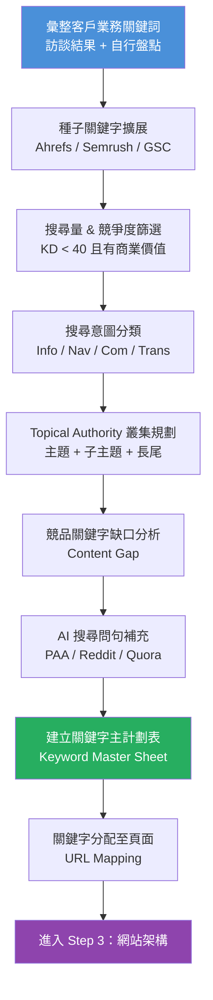

# Step 2｜關鍵字策略

> **目標**：建立以「搜尋意圖」為中心的關鍵字地圖，覆蓋從品牌認知到轉換的完整旅程，並考量 AI 搜尋行為下的主題叢集規劃。

---

## 流程圖



---

## 一、種子關鍵字來源

| 來源 | 說明 | 工具 |
|------|------|------|
| 客戶訪談列表 | 客戶認知的重要詞彙 | 訪談記錄 |
| GSC 現有排名詞 | 已有曝光但尚未充分優化 | Google Search Console |
| 競品關鍵字 | 競品排名但我方沒有的詞 | Ahrefs Site Explorer |
| 相關搜尋 / PAA | Google SERP 延伸詞彙 | Google 搜尋 |
| 長尾延伸工具 | 自動擴展語意相關詞彙 | Ubersuggest / KeywordTool.io |
| AI 問句研究 | 用戶如何向 ChatGPT/Perplexity 提問 | AlsoAsked / AnswerThePublic |
| 論壇社群語言 | 真實用戶的說法與疑問 | PTT / Dcard / Reddit |

---

## 二、搜尋意圖分類（Search Intent）

```
┌──────────────────────────────────────────────────────────────┐
│                    搜尋意圖四象限                              │
├──────────────────┬───────────────────────────────────────────┤
│ 資訊型 (Info)    │ 「什麼是 SEO」「網站速度如何提升」           │
│                  │ → 目標：部落格文章、指南、FAQ                │
├──────────────────┼───────────────────────────────────────────┤
│ 導航型 (Nav)     │ 「Google Analytics 登入」「Ahrefs 官網」     │
│                  │ → 目標：品牌頁、官方頁面                     │
├──────────────────┼───────────────────────────────────────────┤
│ 商業調查 (Com)   │ 「SEO 公司推薦」「SEO 工具比較」              │
│                  │ → 目標：比較頁、評測文、案例頁               │
├──────────────────┼───────────────────────────────────────────┤
│ 交易型 (Trans)   │ 「SEO 顧問費用」「SEO 服務報價」              │
│                  │ → 目標：服務頁、報價頁、聯絡頁               │
└──────────────────┴───────────────────────────────────────────┘
```

---

## 三、關鍵字主計劃表（Keyword Master Sheet 欄位定義）

> 建議在 Google Sheets 或 Notion Database 中建立

| 欄位名稱 | 說明 | 範例 |
|---------|------|------|
| 關鍵字 | 目標搜尋詞 | SEO 顧問台灣 |
| 月搜尋量（TW） | 台灣地區月均搜尋量 | 1,200 |
| 關鍵字難度 KD | 0-100，愈高愈難 | 35 |
| 搜尋意圖 | Info / Nav / Com / Trans | Com |
| 主題叢集 | 所屬主題分組 | SEO 服務 |
| 目標頁面 URL | 規劃由哪個頁面負責 | /seo-consultant/ |
| 目前排名位置 | GSC 或 Ahrefs 查詢 | 位置 24 |
| 競品排名 | 主要競品在此詞的表現 | 競品A 位置 3 |
| 優先級 | High / Mid / Low | High |
| 狀態 | 規劃 / 進行中 / 已發布 / 持續優化 | 進行中 |
| 備註 | 特殊需求或注意事項 | 需搭配 FAQ Schema |

---

## 四、Topical Authority 主題叢集規劃（2026 核心策略）

### 概念說明

```
主題叢集（Topic Cluster）架構：

        ┌─────────────────────┐
        │   支柱頁面 (Pillar)  │  ← 主要服務/品類頁
        │  「SEO 服務完整指南」 │     廣泛覆蓋大主題
        └──────┬──────────────┘
               │
    ┌──────────┼──────────┐
    ▼          ▼          ▼
[子主題1]  [子主題2]  [子主題3]    ← Cluster Content
技術 SEO   關鍵字研究  內容策略       深度覆蓋細節
    │
    ├─[長尾1] Core Web Vitals 怎麼改善
    ├─[長尾2] robots.txt 設定教學
    └─[長尾3] XML Sitemap 怎麼提交
```

### 主題叢集規劃表

| 主支柱主題 | 子主題 | 長尾關鍵字目標 | 頁面數預估 |
|-----------|--------|--------------|----------|
| | | | |
| | | | |
| | | | |

---

## 五、競品關鍵字缺口分析（Content Gap）

### 分析對象

| 競品 | 網址 | Domain Rating | 月流量預估 |
|------|------|--------------|----------|
| 競品 A | | | |
| 競品 B | | | |
| 競品 C | | | |

### 缺口分析結果

| 關鍵字 | 競品A排名 | 競品B排名 | 競品C排名 | 我方排名 | 建議動作 |
|-------|---------|---------|---------|---------|---------|
| | | | | | |
| | | | | | |

---

## 六、AI 搜尋關鍵字補充（2026 GEO 重點）

### 問句型關鍵字清單

AI 搜尋引擎（ChatGPT、Perplexity、Gemini）更常以**完整問句**作為查詢，應特別收集：

| 問句類型 | 範例 | 目標內容格式 |
|---------|------|------------|
| What is...（是什麼） | 什麼是 SEO？ | 定義性文章、FAQ |
| How to...（怎麼做） | 如何提升網站排名？ | 步驟式教學、HowTo Schema |
| Best...（最好的） | 最好的 SEO 工具是什麼？ | 比較文、排名文 |
| Why...（為什麼） | 為什麼我的網站沒有排名？ | 解析文、troubleshooting |
| 本地型 | 台灣有推薦的 SEO 顧問嗎？ | LocalBusiness Schema |

---

## 七、關鍵字分配至頁面（URL Mapping）

> 每個頁面只應主攻 1 個主要關鍵字 + 3-5 個語意相關次要詞

| 頁面類型 | URL | 主要關鍵字 | 次要關鍵字 | 搜尋意圖 |
|---------|-----|----------|----------|---------|
| 首頁 | / | | | |
| 服務頁 | /services/ | | | |
| 案例頁 | /case-studies/ | | | |
| 部落格 | /blog/ | | | |
| 聯絡頁 | /contact/ | | | |

---

## 八、關鍵字策略交付文件

```
[ ] 關鍵字主計劃表（Google Sheets）
    - 500-2,000 組關鍵字（視網站規模）
    - 含搜尋量、KD、意圖分類、優先級
[ ] 主題叢集架構圖（視覺化）
[ ] 競品關鍵字缺口報告
[ ] AI 搜尋問句關鍵字清單
[ ] URL Mapping 表（頁面對應關鍵字）
[ ] 前 30 天攻略關鍵字短名單（高優先、可快速見效）
```

---

## 九、常見地雷與注意事項

> ⚠️ 關鍵字研究常見錯誤：

- **關鍵字蠶食（Keyword Cannibalization）**：多個頁面競爭同一個關鍵字，導致互相排擠 → 解法：合併或設定 Canonical
- **只追大量詞忽略長尾**：台灣市場小，很多高意圖長尾詞月搜尋量僅 50-200，但轉換率極高
- **忽略搜尋意圖**：用「資訊型頁面」去攻「交易型關鍵字」，排名上得去也不轉換
- **沒有定期更新關鍵字表**：搜尋趨勢每季都在變化，建議每季 review 一次

---

*文件系列：SEO SOP 2026 ｜ 上一份：[02_Step1_網站健檢.md](./02_Step1_網站健檢.md) ｜ 下一份：[04_Step3_網站架構規劃.md](./04_Step3_網站架構規劃.md)*
