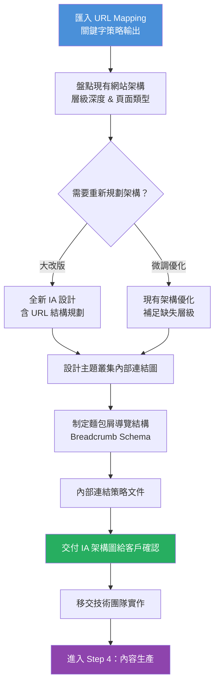

# Step 3｜網站架構規劃（Information Architecture）

> **目標**：根據關鍵字策略與主題叢集，設計合理的網站層級結構，確保爬蟲效率、內部連結權重傳遞、以及用戶瀏覽體驗三者同步優化。

---

## 流程圖



---

## 一、網站層級深度原則

### SEO 黃金法則：3 層點擊原則

```
首頁（/）                           ← 層級 1
  ├── 主要分類頁 (/services/)        ← 層級 2
  │     ├── 子分類頁 (/seo/)         ← 層級 3 ← 最深不超過這裡
  │     │     ├── 文章/產品 A        ← 層級 4（可接受）
  │     │     └── 文章/產品 B
  ├── 部落格 (/blog/)
  │     └── 文章
  └── 關於/聯絡
```

> **原則**：任何頁面距首頁的點擊距離不應超過 3-4 層，否則爬蟲權重衰減、用戶難以找到。

---

## 二、網站架構現況盤點

### 2.1 現有架構層級圖（填寫區）

```
請使用 Screaming Frog 的 Crawl Map 功能產出視覺圖，
或手動填寫以下結構：

首頁（/）
  ├──
  │   ├──
  │   └──
  ├──
  └──
```

### 2.2 現有架構問題評估

| 問題類型 | 是否存在 | 說明 |
|---------|---------|------|
| 頁面層級過深（>4 層） | ☐ 是  ☐ 否 | 受影響頁面：____ 頁 |
| 重要頁面在導覽列中缺席 | ☐ 是  ☐ 否 | |
| 孤兒頁面（無內部連結指向） | ☐ 是  ☐ 否 | 數量：____ |
| 主題分類邏輯混亂 | ☐ 是  ☐ 否 | |
| URL 結構與內容不對應 | ☐ 是  ☐ 否 | |
| 分類頁缺少有意義的內容 | ☐ 是  ☐ 否 | |
| 內部連結分布不均衡 | ☐ 是  ☐ 否 | |

---

## 三、URL 結構設計原則

### 好的 URL 結構範例

```
✅ 好的 URL：
https://example.com/seo-services/technical-seo/
https://example.com/blog/core-web-vitals-guide/
https://example.com/case-studies/ecommerce-seo/

❌ 不好的 URL：
https://example.com/page?id=1234
https://example.com/zh-tw/services/sub1/sub2/sub3/article-001/
https://example.com/blog/2026/04/06/this-is-a-very-long-title-with-lots-of-words/
```

### URL 設計準則

| 準則 | 說明 |
|------|------|
| 使用小寫英文或拼音 | 避免大小寫混用、避免純中文 URL（可含中文但需測試） |
| 使用連字符（-）分隔 | 不用底線（_）或空格 |
| 語意化，見名知意 | `/services/seo/` 優於 `/p/123/` |
| 層級不超過 3-4 層 | 愈短愈好 |
| 避免日期在 URL 中 | 日期型 URL 讓舊文更難維護 |
| 一致的結尾斜線 | 全站統一 `/path/` 或 `/path`，並 301 重定向另一個 |

---

## 四、主題叢集內部連結設計

### 4.1 連結傳遞邏輯

```
┌─────────────────────────────────────────┐
│           內部連結權重傳遞               │
│                                         │
│  支柱頁 ←──── 所有子主題頁 ────────→ 支柱頁
│              （雙向互連）                │
│                                         │
│  子主題頁 ←── 長尾文章 ──→ 子主題頁    │
│                                         │
│  首頁 ──→ 支柱頁（最重要分類）          │
└─────────────────────────────────────────┘
```

### 4.2 內部連結規劃表

| 來源頁面 URL | 目標頁面 URL | 錨文字（Anchor Text） | 連結類型 | 優先級 |
|------------|------------|-------------------|---------|-------|
| | | | 內文/導覽/頁尾 | High/Mid/Low |
| | | | | |
| | | | | |

### 4.3 內部連結健康檢查

| 指標 | 目標 | 現況 |
|------|------|------|
| 首頁出站連結數 | 不超過 100 個 | |
| 支柱頁的內部連結導入數 | 愈多愈好 | |
| 孤兒頁面數量 | 0 | |
| 平均頁面點擊深度 | < 3 層 | |

---

## 五、麵包屑導覽（Breadcrumb）設計

### 結構範例

```
首頁 > SEO 服務 > 技術 SEO > Core Web Vitals 優化指南
```

### Schema 標記範本（BreadcrumbList）

```json
{
  "@context": "https://schema.org",
  "@type": "BreadcrumbList",
  "itemListElement": [
    {
      "@type": "ListItem",
      "position": 1,
      "name": "首頁",
      "item": "https://example.com/"
    },
    {
      "@type": "ListItem",
      "position": 2,
      "name": "SEO 服務",
      "item": "https://example.com/seo-services/"
    },
    {
      "@type": "ListItem",
      "position": 3,
      "name": "技術 SEO",
      "item": "https://example.com/seo-services/technical-seo/"
    }
  ]
}
```

---

## 六、分類頁與支柱頁內容規範

> 許多網站的「分類頁」只有文章列表，沒有實質內容，這樣無法建立主題權威。

**2026 標準：分類頁（支柱頁）應包含：**

| 元素 | 說明 |
|------|------|
| 核心說明文字 | 500-800 字介紹該主題 |
| 相關子主題連結 | 導向各子分類或重要文章 |
| FAQ 區塊 | 3-5 個常見問題 + FAQ Schema |
| 相關資源 | 工具推薦、延伸閱讀 |
| Schema 標記 | Article 或 WebPage + BreadcrumbList |

---

## 七、架構規劃交付文件

```
[ ] 現有架構視覺圖（Screaming Frog Crawl Map 截圖）
[ ] 建議新架構圖（可用 Miro / FigJam / draw.io 製作）
[ ] URL 重新規劃清單（含 301 重定向對應表）
[ ] 內部連結規劃表（優先建立的連結列表）
[ ] 麵包屑導覽結構說明
[ ] 孤兒頁面處理建議（整合/補連結/撤除）
[ ] 分類頁內容補強需求清單
```

---

## 八、注意事項

> ⚠️ 架構調整的高風險操作：

- **URL 更改務必設定 301 重定向**，否則喪失既有排名與連結權重
- **大規模架構調整前先通知客戶**，避免與開發排程衝突
- **搬遷後 48-72 小時**內密切監控 GSC Coverage 與流量變化
- **不要在演算法更新期間進行大改版**（Google 通常在每年 3、8、11 月有核心更新）

---

*文件系列：SEO SOP 2026 ｜ 上一份：[03_Step2_關鍵字策略.md](./03_Step2_關鍵字策略.md) ｜ 下一份：[05_Step4_內容生產優化.md](./05_Step4_內容生產優化.md)*
