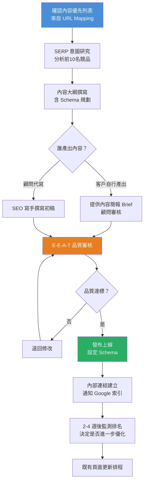

# Step 4｜內容生產與優化

> **目標**：依據關鍵字策略與架構規劃，系統性地生產高品質、符合 E-E-A-T 標準的內容，並持續優化既有頁面以提升排名與 AI 被引用機率。

---

## 流程圖



---

## 一、SERP 競品研究流程（每篇文章必做）

**研究目標關鍵字的 Google 前 10 名，記錄以下資訊：**

| 研究項目 | 觀察重點 |
|---------|---------|
| 內容類型 | 文章/清單/影片/工具/分類頁 |
| 字數範圍 | 各頁面約多少字 |
| H2/H3 小標結構 | 涵蓋哪些子主題 |
| 缺失的角度 | 前10名都沒有提到什麼 |
| SERP Features | 有無 Featured Snippet / PAA / 圖片包 |
| 搜尋意圖確認 | 用戶最終想要什麼答案 |

### SERP 研究記錄表

| URL | 排名 | 字數 | 主要 H2 小標 | 特色 |
|-----|------|------|------------|------|
| | 1 | | | |
| | 2 | | | |
| | 3 | | | |

---

## 二、內容簡報（Content Brief）範本

> 每篇文章開寫前，顧問應準備此簡報給寫手或客戶

```
━━━━━━━━━━━━━━━━━━━━━━━━━━━━━━━━━━━━━━━━━━━━━━━
內容簡報（Content Brief）
━━━━━━━━━━━━━━━━━━━━━━━━━━━━━━━━━━━━━━━━━━━━━━━
目標 URL：
主要關鍵字：
次要關鍵字（語意相關）：
搜尋意圖：  ☐ Info  ☐ Com  ☐ Trans  ☐ Nav
目標字數：  _________ 字（含標題、小標）
目標讀者：
讀者痛點：

━━ 建議文章結構 ━━━━━━━━━━━━━━━━━━━━━━━━━━━━━━━
H1（文章主標題）：
  H2 一：（含目標關鍵字）
    H3 子標 1：
    H3 子標 2：
  H2 二：
    H3 子標 1：
  H2 三：
  H2 FAQ（建議最後一個 H2）：
    Q1：
    Q2：
    Q3：

━━ E-E-A-T 要求 ━━━━━━━━━━━━━━━━━━━━━━━━━━━━━━━
[ ] 作者名稱 & 連結至作者頁
[ ] 發布日期 & 最後更新日期
[ ] 引用可信來源（政府/學術/業界報告）
[ ] 包含個人實際經驗或案例
[ ] 審核人或共同作者（若涉及專業領域）

━━ 多媒體需求 ━━━━━━━━━━━━━━━━━━━━━━━━━━━━━━━━
[ ] 首圖（1200x630px，含 Alt Text）
[ ] 資訊圖表 / 比較表
[ ] 截圖或示範圖
[ ] 影片嵌入（若適合）

━━ Schema 規劃 ━━━━━━━━━━━━━━━━━━━━━━━━━━━━━━━━
☐ Article / BlogPosting  ☐ HowTo  ☐ FAQ  ☐ Product  ☐ Review

━━ 內部連結要求 ━━━━━━━━━━━━━━━━━━━━━━━━━━━━━━━
連入此文的既有頁面（至少 2 個）：
  1.
  2.
此文應連出的重要頁面：
  1.
  2.
━━━━━━━━━━━━━━━━━━━━━━━━━━━━━━━━━━━━━━━━━━━━━━━
```

---

## 三、E-E-A-T 品質審核清單（發布前逐項確認）

### Experience（親身經驗）

| 項目 | 檢查 |
|------|------|
| 文章是否包含作者的親身經驗或真實案例 | ☐ 是  ☐ 否 |
| 是否有第一人稱的觀點或見解 | ☐ 是  ☐ 否 |
| 截圖、數據、個人案例是否來自真實操作 | ☐ 是  ☐ N/A |

### Expertise（專業知識）

| 項目 | 檢查 |
|------|------|
| 內容是否符合業界標準與最新知識 | ☐ 是  ☐ 否 |
| 是否有引用可信的外部來源 | ☐ 是  ☐ 否 |
| 技術術語使用是否正確 | ☐ 是  ☐ 否 |

### Authoritativeness（權威性）

| 項目 | 檢查 |
|------|------|
| 作者名稱是否清楚顯示 | ☐ 是  ☐ 否 |
| 作者頁是否有完整簡介、資歷、社群連結 | ☐ 是  ☐ 否 |
| 網站是否有「關於我們」頁面 | ☐ 是  ☐ 否 |

### Trustworthiness（可信度）

| 項目 | 檢查 |
|------|------|
| 發布日期與最後更新日期是否標示 | ☐ 是  ☐ 否 |
| 是否有隱私政策、服務條款頁面 | ☐ 是  ☐ 否 |
| 外部連結是否指向可信來源 | ☐ 是  ☐ 否 |
| 是否有聯絡資訊（非隱藏） | ☐ 是  ☐ 否 |
| 商業頁面是否顯示聯絡電話/地址/公司統編 | ☐ 是  ☐ N/A |

---

## 四、On-Page SEO 技術元素確認

| 元素 | 規範 | 確認 |
|------|------|------|
| Title Tag | 30-60 字元，含主要關鍵字，放在前段 | ☐ |
| Meta Description | 80-160 字元，含 CTA，不重複 | ☐ |
| H1 | 唯一，與 Title 相近但不完全相同 | ☐ |
| URL | 簡短語意化，含目標關鍵字 | ☐ |
| 首圖 Alt Text | 描述性，含目標關鍵字（自然融入） | ☐ |
| 關鍵字自然密度 | 主要詞 0.5-1.5%，語意相關詞 spread out | ☐ |
| 內部連結 | 至少 2-3 個出站連結至相關頁面 | ☐ |
| 外部連結 | 引用來源 nofollow 或 ugc 標記 | ☐ |
| Schema 標記 | 依 Brief 設定並通過 Google 驗證工具 | ☐ |
| 頁面載入速度 | 新文章不引入不必要的重型腳本或大圖 | ☐ |

---

## 五、內容更新策略（2026 趨勢重點）

### 5.1 何時應該更新既有內容？

| 觸發條件 | 說明 |
|---------|------|
| 排名大幅下滑（>5 位） | 可能被更新的競品超越 |
| 流量下跌超過 20% 連續 2 個月 | 內容可能過時或意圖偏移 |
| 主題有重大新發展 | 政策改變、工具更新、研究報告 |
| 文章距上次更新超過 1 年 | 定期刷新以維持「新鮮度信號」 |
| AI 搜尋引用競品而非我方 | 內容深度或可引用性不足 |

### 5.2 內容更新優先排序矩陣

```
高流量 + 排名下滑  →  🔴 立即更新（最高優先）
高流量 + 排名穩定  →  🟡 定期維護（每年更新）
低流量 + 排名前10  →  🟠 加強推廣（補充連結）
低流量 + 排名後段  →  🔵 評估整合或撤除
```

---

## 六、AI 輔助內容生產準則（2026）

> 使用 AI 工具（Claude、ChatGPT 等）輔助內容時，必須遵守以下規範，以避免觸發 Google「有用性更新（Helpful Content Update）」懲罰：

| 規範 | 說明 |
|------|------|
| AI 生成後必須人工審核 | 100% AI 生成的內容風險極高 |
| 注入個人經驗與觀點 | 這是 AI 無法替代的部分 |
| 加入真實數據與案例 | 非通用性描述，需有具體事例 |
| 不抄襲競品架構 | AI 容易複製熱門文章結構 |
| 符合品牌語氣 | 每個客戶有不同的品牌聲音 |
| 發布後標示「AI 協助撰寫，人工審核」 | 透明度是未來趨勢 |

---

## 七、內容生產排程表（範本）

| 週次 | 預計發布文章 | 目標關鍵字 | 負責人 | 狀態 | 備註 |
|------|-----------|----------|-------|------|------|
| 第 1 週 | | | | 規劃中 | |
| 第 2 週 | | | | 規劃中 | |
| 第 3 週 | | | | 規劃中 | |
| 第 4 週 | | | | 規劃中 | |

**建議發布頻率：**
- 小型網站：每月 2-4 篇深度文章（優質 > 量）
- 中型網站：每月 4-8 篇
- 大型媒體型網站：每週 3-5 篇

---

## 八、交付文件

```
[ ] 內容優先列表（前 30 天攻略清單）
[ ] 每篇文章的 Content Brief
[ ] 已發布文章的 E-E-A-T 審核紀錄
[ ] 內容更新排程表（既有頁面維護計劃）
[ ] 每月內容績效報告（排名/流量/停留時間）
```

---

*文件系列：SEO SOP 2026 ｜ 上一份：[04_Step3_網站架構規劃.md](./04_Step3_網站架構規劃.md) ｜ 下一份：[06_Step5_技術優化.md](./06_Step5_技術優化.md)*
