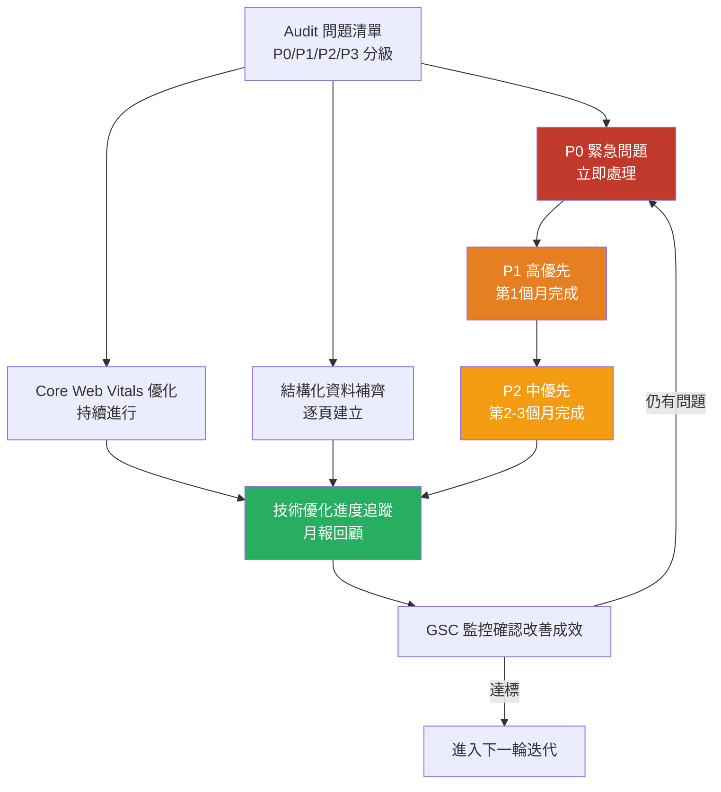

# Step 5｜技術優化（Technical SEO）

> **目標**：系統性解決 Audit 中發現的技術問題，同步於內容生產階段進行，確保網站基礎健全，讓 Google 與 AI 爬蟲能最有效率地抓取與理解內容。

> **執行時間**：與 Step 4 同步進行，持續貫穿整個合作期間。

---

## 流程圖



---

## 一、技術優化主清單（依優先級）

### 🔴 P0 緊急問題（1 週內修復）

| 項目 | 問題說明 | 修復方式 | 負責方 | 截止日 | 狀態 |
|------|---------|---------|-------|-------|------|
| noindex 誤封鎖重要頁面 | robots.txt 或 meta 誤設 | 移除 noindex 指令 | 開發 | | ☐ |
| 全站無 HTTPS | HTTP 未重定向 | 安裝 SSL 憑證 | 主機/開發 | | ☐ |
| 無法索引（Google 顯示找不到頁面） | Sitemap 或 URL 設定錯誤 | 確認正確 URL 並重新提交 | 顧問 | | ☐ |
| 核心頁面 404 | 重要 URL 回傳 404 | 301 重定向或恢復頁面 | 開發 | | ☐ |
| Google 手動懲罰通知 | GSC 人工操作報告有警示 | 依警示類型處理 | 顧問 | | ☐ |

---

### 🟠 P1 高優先問題（第 1 個月）

| 項目 | 目標 | 負責方 |
|------|------|-------|
| XML Sitemap 整理與提交 | 只含正常、indexed 頁面 | 顧問 |
| robots.txt 優化 | 允許爬取所有重要頁面 | 顧問+開發 |
| 重複內容 Canonical 設定 | 每頁有且只有一個正確 canonical | 開發 |
| www/non-www 統一 301 重定向 | 全站統一 | 開發 |
| 重定向鏈（Redirect Chain）清理 | 單一 301，不超過 2 跳 | 開發 |
| Hreflang 設定（多語言站） | 正確標記語言與地區 | 開發 |
| 結構化資料：Organization Schema | 品牌基礎信號 | 顧問 |

---

### 🟡 P2 中優先問題（第 2-3 個月）

| 項目 | 目標 | 負責方 |
|------|------|-------|
| Core Web Vitals LCP 優化 | LCP < 2.5 秒 | 開發+設計 |
| Core Web Vitals INP 優化 | INP < 200ms | 開發 |
| Core Web Vitals CLS 優化 | CLS < 0.1 | 開發+設計 |
| 圖片壓縮與 WebP 轉換 | 所有圖片 < 100KB | 開發/顧問 |
| Lazy Loading 實作 | 非首屏圖片延遲載入 | 開發 |
| 缺少 Alt Text 圖片補齊 | 100% Alt Text 覆蓋 | 顧問 |
| 內部連結孤兒頁面修復 | 所有頁面至少 1 個內部連結指向 | 顧問 |
| 破損內部連結修復 | 0 個 broken link | 開發/顧問 |
| Title / Meta 重複問題修復 | 每頁獨特 Title & Meta Description | 顧問 |

---

### 🟢 P3 持續優化（長期改善）

| 項目 | 說明 |
|------|------|
| Log File 分析 | 每月分析 Googlebot 爬取行為，優化爬取預算 |
| 結構化資料擴充 | FAQ、HowTo、Review、Product 依內容逐步補齊 |
| 預渲染/SSR 優化 | JS 框架（React/Vue）確保 Googlebot 可正確渲染 |
| CDN 加速 | 全球 CDN 節點，改善 TTFB |
| 服務器快取優化 | 靜態快取、Redis 快取設定 |
| 行動版體驗審核 | 每季以行動裝置實際測試 |

---

## 二、Core Web Vitals 優化指南（2026 版）

### 2.1 LCP（最大內容元素載入時間）

**目標：< 2.5 秒**

常見原因與解法：

| 問題原因 | 解決方案 |
|---------|---------|
| 首圖未預載（Preload） | 在 `<head>` 加入 `<link rel="preload">` |
| 圖片過大（> 500KB） | 壓縮並轉換為 WebP 格式 |
| 伺服器回應慢（TTFB > 600ms） | 升級主機方案 / 啟用快取 / CDN |
| CSS/JS 阻塞渲染 | 非同步載入（async/defer）、CSS inline 首屏樣式 |
| 第三方腳本拖慢 | 延遲載入追蹤腳本（GTM, FB Pixel） |

---

### 2.2 INP（互動到下一個繪製，2024 取代 FID）

**目標：< 200ms**

| 問題原因 | 解決方案 |
|---------|---------|
| 主執行緒被長任務佔用 | 拆分長任務（Task Chunking） |
| JavaScript 過重 | Tree shaking、code splitting |
| 事件監聽器過多 | 使用事件委派（Event Delegation） |
| 第三方腳本阻塞 | 延遲非必要腳本載入 |

---

### 2.3 CLS（視覺穩定性）

**目標：< 0.1**

| 問題原因 | 解決方案 |
|---------|---------|
| 圖片/影片無設定尺寸 | 所有 `` 加入 `width` 和 `height` 屬性 |
| 廣告/嵌入內容佔位不足 | 預留空間，避免動態插入 |
| 字型閃爍（FOIT/FOUT） | 使用 `font-display: swap` + preload 字型 |
| 動態插入內容（Banner/Popup） | 避免在頁面頂部動態插入元素 |

---

## 三、結構化資料（Schema.org）實作計劃

### 3.1 必備基礎 Schema

```json
// Organization Schema（每個網站首頁必備）
{
  "@context": "https://schema.org",
  "@type": "Organization",
  "name": "公司名稱",
  "url": "https://example.com",
  "logo": "https://example.com/logo.png",
  "contactPoint": {
    "@type": "ContactPoint",
    "telephone": "+886-2-XXXX-XXXX",
    "contactType": "customer service",
    "areaServed": "TW",
    "availableLanguage": "zh-TW"
  },
  "sameAs": [
    "https://www.facebook.com/example",
    "https://www.linkedin.com/company/example"
  ]
}
```

### 3.2 Schema 實作進度追蹤

| 頁面類型 | Schema 類型 | 是否已實作 | 驗證狀態 |
|---------|------------|----------|---------|
| 首頁 | Organization + WebSite | ☐ | |
| 服務頁 | Service | ☐ | |
| 部落格文章 | Article + Author | ☐ | |
| FAQ 頁面/區塊 | FAQPage | ☐ | |
| 聯絡頁 | LocalBusiness | ☐ | |
| 如何做文章 | HowTo | ☐ | |
| 麵包屑 | BreadcrumbList | ☐ | |

> 驗證工具：[Google Rich Results Test](https://search.google.com/test/rich-results)

---

## 四、行動版優化確認表

| 項目 | 標準 | 確認 |
|------|------|------|
| 使用 Responsive Design | 同一套 HTML，CSS 自適應 | ☐ |
| 按鈕大小 | 最小 48x48 px，間距 >= 8px | ☐ |
| 字體大小 | 內文至少 16px | ☐ |
| 無水平捲軸 | 所有元素不超出視窗寬度 | ☐ |
| 行動版購買/轉換流程可操作 | CTA 按鈕易點按 | ☐ |
| 表單欄位鍵盤類型設定 | email/tel/number 用對應 input type | ☐ |

---

## 五、每月技術健康度回顧指標

| 指標 | 上月數值 | 本月數值 | 變化 |
|------|---------|---------|------|
| GSC 總索引頁面數 | | | |
| GSC 排除頁面數 | | | |
| LCP（中位數） | | | |
| INP（中位數） | | | |
| CLS（中位數） | | | |
| 404 頁面數量 | | | |
| 爬蟲錯誤數 | | | |
| 結構化資料錯誤數 | | | |

---

## 六、技術優化交付文件

```
[ ] 技術問題修復進度表（每月更新）
[ ] Core Web Vitals 改善報告（before / after）
[ ] 結構化資料實作清單
[ ] robots.txt & Sitemap 更新記錄
[ ] 301 重定向對應表
[ ] 技術修復截圖存檔（留存歷史紀錄）
```

---

*文件系列：SEO SOP 2026 ｜ 上一份：[05_Step4_內容生產優化.md](./05_Step4_內容生產優化.md) ｜ 下一份：[07_Step6_外部連結建立.md](./07_Step6_外部連結建立.md)*
