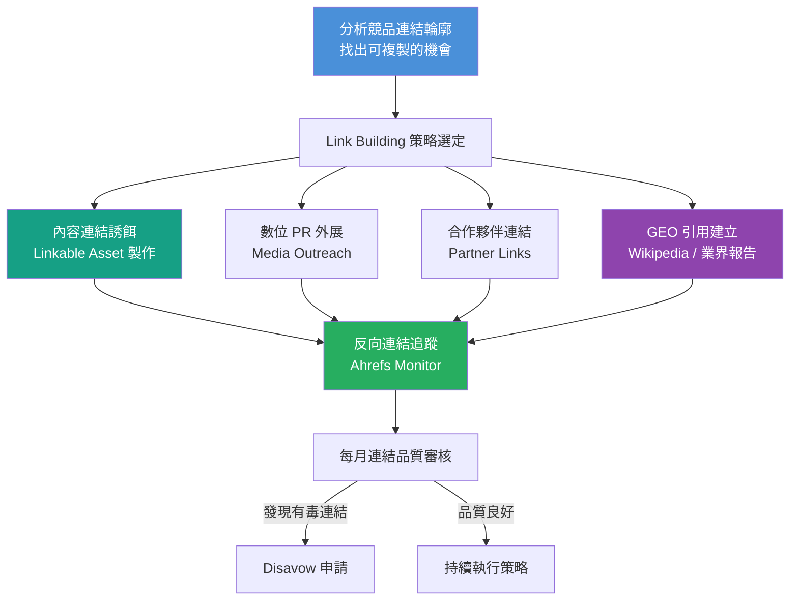

# Step 6｜外部連結建立（Link Building & GEO 引用）

> **目標**：透過系統性策略建立高品質反向連結，同時在 2026 年 GEO 趨勢下，積極布局品牌在 AI 搜尋中的被引用能見度，強化整體域名權威。

---

## 流程圖



---

## 一、反向連結品質評估標準（2026）

### 連結品質矩陣

```
高 DA + 高相關性  →  🏆 最佳連結（全力爭取）
高 DA + 低相關性  →  🟡 次優（接受但非優先）
低 DA + 高相關性  →  🟢 可接受（長尾積累）
低 DA + 低相關性  →  🔴 避免或 Disavow
```

### 連結品質評估標準

| 評估維度 | 好的連結 | 壞的連結 |
|---------|---------|---------|
| 來源網站 DA/DR | > 30 | < 10 |
| 相關性 | 同行業或相關主題 | 毫無相關（賭博/成人/垃圾） |
| 錨文字 | 品牌名稱、自然語句 | 過度優化的關鍵字錨文字 |
| 連結位置 | 內文（Editorial） | 頁尾、側欄、連結農場 |
| 流量 | 來源網站有真實流量 | 幾乎無人造訪的網站 |
| 連結類型 | dofollow | 大量 nofollow（非完全無價值） |

---

## 二、Link Building 策略清單（2026 版）

### 2.1 內容連結誘餌（Linkable Asset）

> **原則**：好的內容自然吸引連結，這是最可持續的 Link Building 策略。

| 內容類型 | 說明 | 連結吸引力 |
|---------|------|----------|
| 原創研究報告 | 業界調查數據、台灣市場報告 | ⭐⭐⭐⭐⭐ |
| 終極指南 / Ultimate Guide | 超詳細、權威的主題完整指南 | ⭐⭐⭐⭐ |
| 免費工具 / 計算機 | 提供實際使用價值的互動工具 | ⭐⭐⭐⭐⭐ |
| 資訊圖表 | 視覺化呈現複雜數據 | ⭐⭐⭐ |
| 專家意見彙整 | 採訪多位業界專家 | ⭐⭐⭐⭐ |
| 統計數據頁 | 彙整業界重要統計數字 | ⭐⭐⭐⭐ |
| 公開模板/工具表 | 可下載的實用模板 | ⭐⭐⭐ |

---

### 2.2 數位 PR 外展計劃

#### 目標媒體清單（依產業調整）

| 媒體類型 | 範例（台灣） | 目標合作方式 |
|---------|------------|------------|
| 科技媒體 | iThome、數位時代、TechOrange | 新聞稿、專家評論 |
| 商業媒體 | 商業週刊、遠見、天下雜誌 | 調查報告引用 |
| 行銷社群 | Inside、行銷人、社群島 | 客座文章、採訪 |
| 產業協會 | 各商業公會、工研院 | 會員資源、報告引用 |
| 大學/研究機構 | 政大傳播學院、交大 | 學術資源引用 |

#### 外展記錄表

| 日期 | 目標媒體 | 聯絡人 | 提案內容 | 狀態 | 結果 | 連結 URL |
|------|---------|-------|---------|------|------|---------|
| | | | | 待回應 | | |
| | | | | | 已刊出 | |

#### 媒體外展郵件模板

```
主旨：[媒體名稱] 合作提案：關於「[主題]」的獨家洞察

[媒體/編輯姓名] 您好，

我是 [姓名]，[公司名稱] 的 [職稱]。

我們最近完成了一份關於「[主題]」的研究報告，
發現了幾個台灣市場的有趣趨勢：

• 發現 1：[數據/洞察]
• 發現 2：[數據/洞察]

這份研究對 [媒體名稱] 的讀者應該很有價值，
我想詢問是否有合作刊登或採訪的機會？

完整報告可以在此查看：[連結]

期待您的回覆！

[姓名]
[聯絡方式]
```

---

### 2.3 競品失效連結策略（Broken Link Building）

**流程：**

1. 用 Ahrefs 找出競品已失效的外部連結
2. 確認原始連結的內容主題
3. 在自己網站上建立更好的替代內容
4. 通知原連結來源網站，建議更換連結

---

### 2.4 資源頁連結（Resource Page Link Building）

**搜尋指令（Google Operators）：**

```
[你的主題] + "推薦資源" site:.tw
[你的主題] + "相關連結" site:.tw
[你的主題] + "資源整理" filetype:html
inurl:resources + [你的主題] + site:.tw
```

---

### 2.5 在地連結建設（台灣在地策略）

| 管道 | 說明 |
|------|------|
| Google Business Profile | 確保資訊完整，定期發布 Update |
| 工商名錄 | 台灣黃頁、1111 商搜網、台灣商業名錄 |
| 商業公會/協會 | 申請會員資格，取得會員頁連結 |
| Dcard / PTT | 品牌相關討論串的自然提及 |
| LINE 官方帳號 | 建立官方頁面，增加品牌信號 |
| 台灣本地媒體 | 地方新聞、城市雜誌 |

---

## 三、GEO 引用建立策略（2026 新重點）

> **GEO（Generative Engine Optimization）**：讓品牌內容被 ChatGPT、Perplexity、Gemini 等 AI 搜尋引擎引用的策略。

### 3.1 被 AI 引用的關鍵因素

| 因素 | 說明 | 行動項目 |
|------|------|---------|
| 可信來源引用 | AI 優先引用被媒體/學術機構引用的來源 | 爭取媒體露出 |
| 結構化資訊 | Schema.org 標記讓 AI 更容易解析 | 補齊 Schema |
| 事實性準確 | AI 引擎傾向引用準確、可驗證的資訊 | 引用官方數據 |
| 品牌知識圖譜 | Google 知識圖譜中的品牌記錄 | 建立 Wikidata 條目 |
| 被其他資源引用 | 越多可信站點提及，AI 引用機率越高 | 數位 PR + 合作 |

### 3.2 GEO 引用清單

| 管道 | 是否已建立 | 優先級 | 備註 |
|------|----------|-------|------|
| Wikipedia 條目 | ☐ | High | 需符合 Wikipedia 收錄標準 |
| Wikidata 條目 | ☐ | High | 建立品牌知識圖譜基礎 |
| Crunchbase 公司頁 | ☐ | Mid | 科技/新創品牌優先 |
| 業界報告引用 | ☐ | High | 工研院、IDC、資策會 |
| Google Business Profile | ☐ | High | 台灣品牌必備 |
| LinkedIn 公司頁 | ☐ | Mid | 職業信號 |
| 媒體專訪/報導 | ☐ | High | 媒體可信度背書 |

---

## 四、有毒連結管理（Toxic Links）

### 4.1 識別有毒連結

| 特徵 | 說明 |
|------|------|
| 垃圾目錄 | 低品質連結農場、付費連結目錄 |
| 不相關網站大量連結 | 成人、賭博、藥品等不相關站點 |
| 錨文字過度優化 | 大量精確關鍵字錨文字 |
| 自然流量為零的網站 | Ahrefs Traffic = 0 |
| 突然暴增的連結 | 短時間大量新增，可能是負面 SEO 攻擊 |

### 4.2 Disavow 申請流程

1. 在 Ahrefs / GSC 匯出問題連結清單
2. 整理成 `disavow.txt` 格式
3. 至 Google Search Console → 撤銷連結工具 上傳
4. 記錄日期，3-4 個月後觀察效果

```
# Disavow 文件格式範例
# 撤銷特定頁面的連結
https://spam-site.com/bad-page

# 撤銷整個域名的連結
domain:spam-domain.com
```

---

## 五、反向連結監控儀表板（每月追蹤）

| 指標 | 上月 | 本月 | 目標 |
|------|------|------|------|
| 總 Referring Domains 數 | | | 月增 5-10 個 |
| 新增高品質連結（DR>30） | | | |
| 失效連結數 | | | 0 |
| 有毒連結比例 | | | < 5% |
| 平均 Domain Rating | | | 持續提升 |
| 競品 DR 對比 | | | |

---

## 六、Link Building 交付文件

```
[ ] 競品連結輪廓分析報告
[ ] Link Building 策略計劃書（含 3 個月行動計劃）
[ ] 外展媒體名單與聯絡記錄
[ ] 每月新增連結清單（含品質評分）
[ ] Disavow 文件記錄（若有）
[ ] GEO 引用建立進度表
```

---

*文件系列：SEO SOP 2026 ｜ 上一份：[06_Step5_技術優化.md](./06_Step5_技術優化.md) ｜ 下一份：[08_Step7_數據監測迭代.md](./08_Step7_數據監測迭代.md)*
