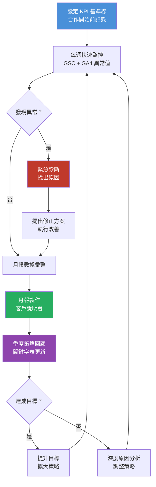

# Step 7｜數據監測與迭代

> **目標**：建立系統化的數據追蹤機制，定期檢視成效並根據數據做出有依據的迭代決策，確保 SEO 投資持續產出回報。

---

## 流程圖



---

## 一、KPI 設定框架

### 1.1 三層 KPI 體系

```
層級一：業務指標（老闆關心的）
  └── 自然搜尋帶來的表單填寫數
  └── 自然搜尋帶來的電商營收
  └── 自然搜尋帶來的電話詢問數

層級二：SEO 指標（執行關心的）
  └── 自然搜尋流量（Sessions）
  └── 目標關鍵字排名
  └── 新獲取反向連結數

層級三：技術指標（健康度基礎）
  └── Core Web Vitals 評分
  └── GSC 索引頁面數
  └── 爬蟲錯誤數量
```

### 1.2 KPI 基準記錄表（合作第一天填寫）

| KPI 項目 | 起始基準值 | 3 個月目標 | 6 個月目標 | 12 個月目標 |
|---------|---------|----------|----------|-----------|
| **業務指標** | | | | |
| 每月自然搜尋詢問數 | | | | |
| 自然搜尋轉換率 | | | | |
| **流量指標** | | | | |
| 每月自然搜尋 Sessions | | | | |
| 每月自然搜尋 Users | | | | |
| 平均自然搜尋跳出率 | | | | |
| **關鍵字指標** | | | | |
| 排名前 10 的關鍵字數 | | | | |
| 排名前 3 的關鍵字數 | | | | |
| 目標關鍵字平均排名 | | | | |
| **技術指標** | | | | |
| GSC 總索引頁面數 | | | | |
| LCP 中位數（行動版） | | | | |
| CLS（行動版） | | | | |
| **站外指標** | | | | |
| Referring Domains 數 | | | | |
| Domain Rating (Ahrefs DR) | | | | |

---

## 二、監測工具與頻率

| 工具 | 監測內容 | 頻率 |
|------|---------|------|
| Google Search Console | 排名、點擊、索引狀態、爬蟲錯誤 | 每週 |
| Google Analytics 4 | 流量趨勢、轉換、用戶行為 | 每週 |
| Ahrefs / Semrush | 排名追蹤、反向連結監控 | 每週 |
| PageSpeed Insights | Core Web Vitals 變化 | 每月 |
| GSC Core Web Vitals 報告 | 實際使用者數據（CrUX） | 每月 |
| Google Alerts | 品牌提及、關鍵詞新聞 | 即時（每日摘要） |
| Ahrefs Alerts | 新增/失效反向連結 | 即時 |

---

## 三、每週快速監控清單

> 每週五花 30 分鐘完成以下確認（預防問題擴大）

```
GSC 快速掃描（15 分鐘）
[ ] 點擊量與上週相比是否異常（±30% 為警戒線）
[ ] 是否有新的手動操作通知
[ ] 是否有新的爬取問題
[ ] 索引頁面數是否突然大幅減少
[ ] 是否有安全性問題通知

GA4 快速掃描（10 分鐘）
[ ] Organic Search Sessions 與上週相比
[ ] 是否有特定頁面流量暴跌
[ ] 轉換率是否正常

排名快速掃描（5 分鐘）
[ ] 目標關鍵字清單中是否有明顯大幅下滑
[ ] 競品是否有明顯突破
```

---

## 四、月報範本結構

> 每月固定交付客戶，建議月底出報、月初簡報

```
━━━━━━━━━━━━━━━━━━━━━━━━━━━━━━━━━━━━
[客戶名稱] SEO 月報
報告期間：YYYY 年 MM 月
━━━━━━━━━━━━━━━━━━━━━━━━━━━━━━━━━━━━

一、執行摘要（2-3 段，老闆版本）
   - 本月亮點：
   - 待解決問題：
   - 下月重點工作：

二、關鍵指標儀表板
   ┌──────────┬────────┬────────┬────────┐
   │ 指標     │ 上月   │ 本月   │ 變化   │
   ├──────────┼────────┼────────┼────────┤
   │ 自然流量 │        │        │        │
   │ 轉換數   │        │        │        │
   │ 前10排名 │        │        │        │
   │ 新連結數 │        │        │        │
   └──────────┴────────┴────────┴────────┘

三、關鍵字排名報告
   - 進步最多的 10 個關鍵字
   - 退步需注意的關鍵字
   - 首次進入前 10 的關鍵字

四、流量分析
   - 整體趨勢圖（GA4 截圖）
   - 流量最高的 10 個頁面
   - 轉換漏斗分析

五、本月完成工作
   - 技術優化：
   - 內容發布：（列出文章名稱與 URL）
   - 連結建立：
   - 其他：

六、下月工作計劃
   - 優先事項 1：
   - 優先事項 2：
   - 優先事項 3：

七、問題與風險提示
   （若有演算法更新、競品動態等需告知客戶）
━━━━━━━━━━━━━━━━━━━━━━━━━━━━━━━━━━━━
```

---

## 五、季度策略回顧

> 每 3 個月進行深度回顧，重新校正方向（建議以線上會議進行）

### 季度回顧議程（90 分鐘）

| 時間 | 議題 |
|------|------|
| 0-15 min | 過去 3 個月成效總結 |
| 15-30 min | KPI 達成率與差距分析 |
| 30-45 min | 競品動態分析 |
| 45-60 min | 關鍵字機會更新（新詞/撤出詞） |
| 60-75 min | 下季度策略調整討論 |
| 75-90 min | Q&A 與行動方案確認 |

### 季度回顧清單

```
數據面
[ ] 與季初 KPI 目標對比分析
[ ] 成效最好與最差的頁面盤點
[ ] 流量來源結構是否健康
[ ] 轉換路徑是否有優化空間

關鍵字面
[ ] 更新關鍵字主計劃表
[ ] 移除無潛力關鍵字
[ ] 新增新興趨勢關鍵字
[ ] 重新評估攻克優先順序

競品面
[ ] 競品排名變化
[ ] 競品新增內容主題
[ ] 競品連結策略觀察

策略面
[ ] 是否需要調整主題叢集架構
[ ] 是否需要引入新的 Link Building 管道
[ ] 預算分配是否需調整
[ ] 是否有新的 GEO 機會
```

---

## 六、演算法更新應對機制

> Google 每年有多次核心演算法更新，需有標準應對 SOP

| 階段 | 動作 | 時程 |
|------|------|------|
| 更新發布 | 記錄更新日期，不立即做出大改動 | 更新當日 |
| 觀察期 | 監控流量與排名 7-14 天 | 更新後 1-2 週 |
| 影響評估 | 確認是否受到負面影響及受影響頁面 | 第 2-3 週 |
| 原因分析 | 對比 Google 公告的更新重點分析 | 第 3-4 週 |
| 改善計劃 | 制定針對性改善方案 | 第 4-6 週 |
| 觀察復原 | 執行改善後等待下次更新確認復原 | 下次核心更新後 |

---

## 七、Google Analytics 4 重要事件設定

> 確保以下轉換事件已在 GA4 中正確設定

| 事件名稱 | 觸發條件 | 重要性 |
|---------|---------|-------|
| `generate_lead` | 填寫詢問表單 | 🔴 必設 |
| `purchase` | 電商購買完成 | 🔴 必設（電商） |
| `phone_call_click` | 點擊電話號碼 | 🟠 建議設 |
| `file_download` | 下載 PDF/文件 | 🟡 依需求 |
| `video_start` | 播放影片 | 🟡 依需求 |
| `scroll_depth` | 捲動 75% 以上 | 🟢 參考用 |
| `time_on_page` | 停留超過 2 分鐘 | 🟢 參考用 |

---

## 八、迭代決策矩陣

| 情境 | 可能原因 | 建議行動 |
|------|---------|---------|
| 流量持續下降 2 個月 | 演算法更新 / 競品超越 / 技術問題 | 深度 Audit → 對症下藥 |
| 排名停滯在 11-20 | 內容深度不足 / 連結太少 | 更新內容 + 加強連結 |
| 流量多但轉換率低 | 搜尋意圖不符 / Landing Page 不佳 | 審視頁面意圖對應 + CRO |
| 某頁面突然大幅提升 | 被 AI 引用 / 演算法加分 | 研究原因 → 複製到其他頁 |
| 競品突然超越 | 競品更新內容或獲得大型連結 | 分析競品動作 → 跟進優化 |

---

## 九、交付文件

```
[ ] 每月 SEO 月報（PDF 格式）
[ ] 關鍵字排名追蹤表（每月更新）
[ ] KPI 儀表板（Google Looker Studio）
[ ] 季度策略回顧會議記錄
[ ] 演算法更新影響評估報告（若有影響）
[ ] 年度 SEO 成效總報告
```

---

*文件系列：SEO SOP 2026 ｜ 上一份：[07_Step6_外部連結建立.md](./07_Step6_外部連結建立.md) ｜ 下一份：[09_2026報價說明.md](./09_2026報價說明.md)*
