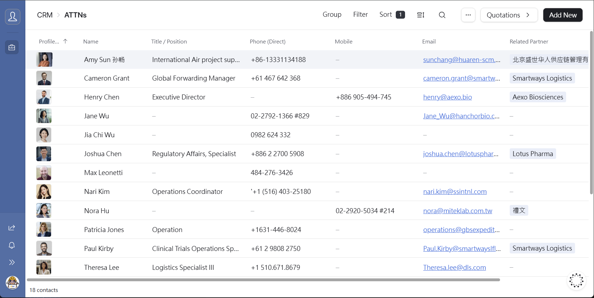
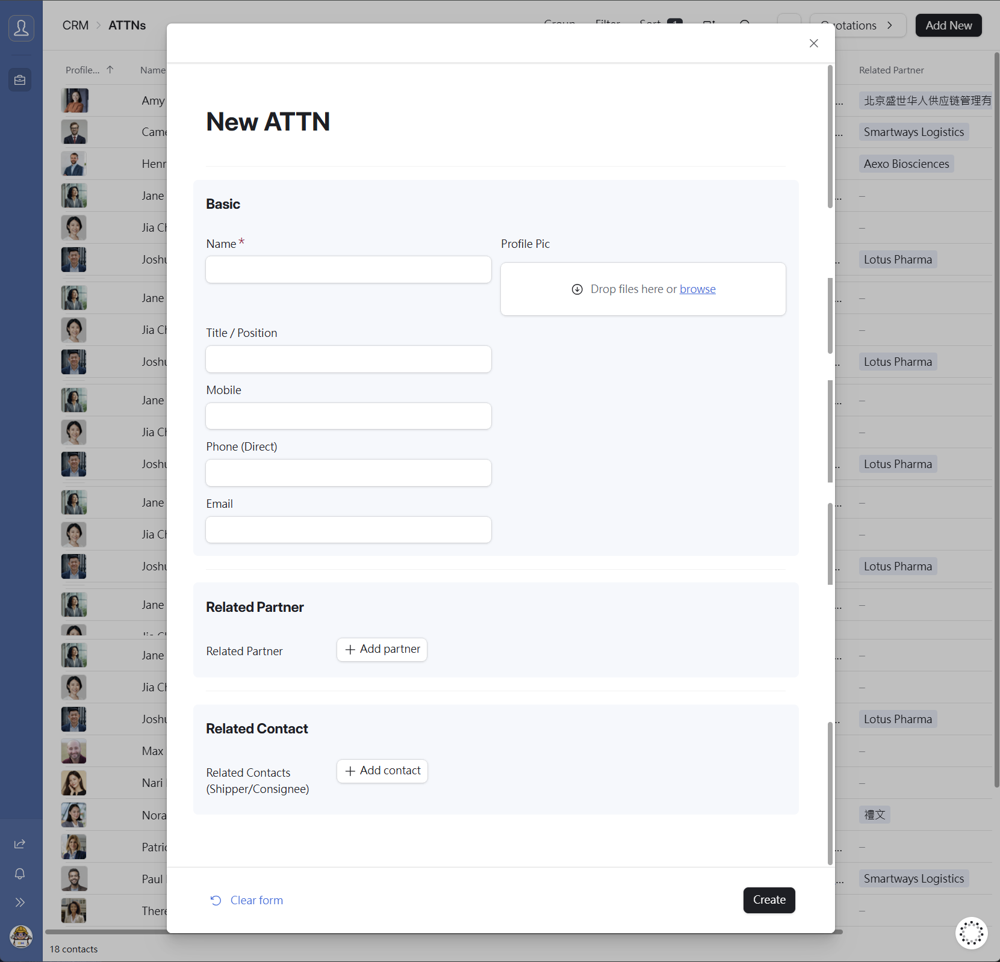
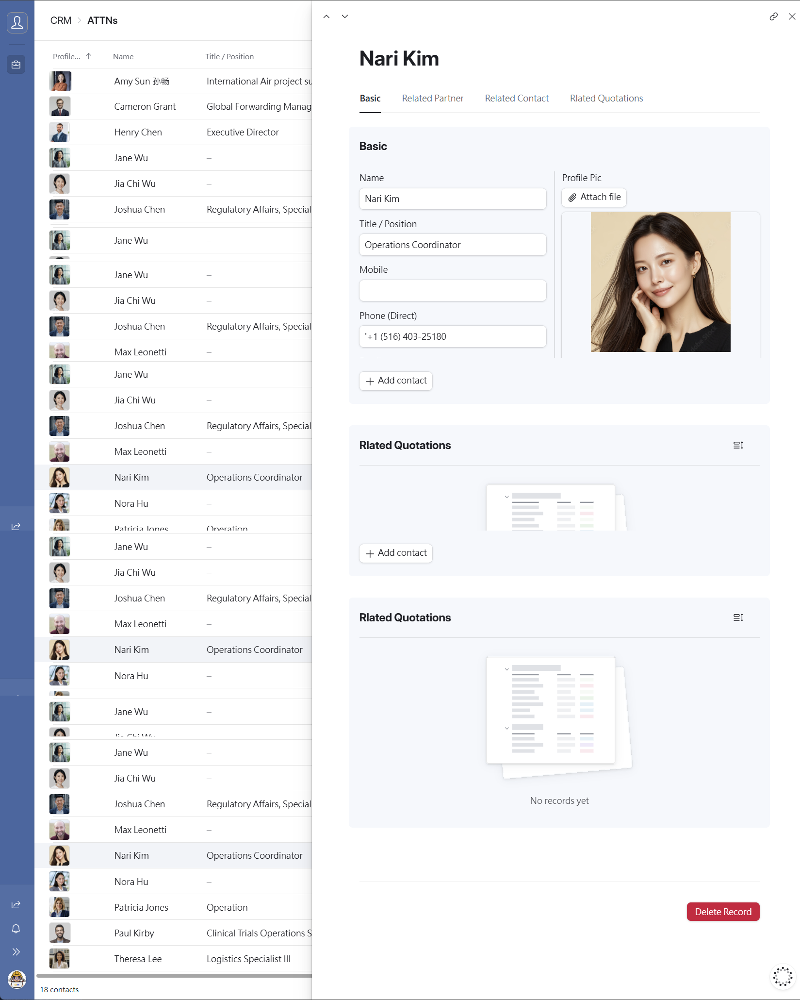
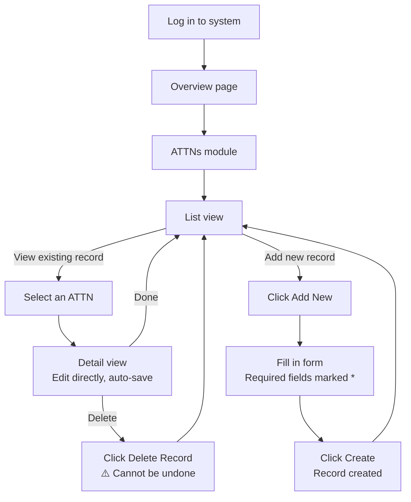

# Chapter 4 — ATTNs

---

## 4.1 Module Overview

The **ATTNs** module stores individual contact persons linked to Partners and Shippers / Consignees. Each record represents a specific person — their name, title, and contact details — and can be associated with one or more companies within the system.

ATTNs serve as the bridge between companies and people: when a Partner or Shipper / Consignee record needs a point of contact, it links to an ATTN record.

---

## 4.2 Viewing the ATTN List

Click **ATTNs** in the sidebar to open the list view.

The list displays the following columns:

| Column          | Description                              |
| --------------- | ---------------------------------------- |
| Name            | Contact person's full name (with photo)  |
| Title / Position | Job title or role of the contact person |
| Phone (Direct)  | Direct phone number                      |
| Mobile          | Mobile phone number                      |
| Email           | Email address                            |
| Related Partner | The partner company this contact belongs to |

---

## 4.3 Adding a New ATTN

1. Click the **[Add New]** button in the top-right corner of the list page.
2. The **New ATTN** form will appear on the right side of the screen.
3. Fill in the required fields (marked with a **red \***).
4. Click **[Create]** at the bottom-right to save the record.

### Form Field Reference

**Basic Information**

| Field           | Required    | Notes                                                  |
| --------------- | ----------- | ------------------------------------------------------ |
| Name            | ✅ Required | Contact person's full name                             |
| Profile Pic     | Optional    | Photo — drag and drop or click **Browse** to upload    |
| Title / Position | Optional   | Job title or role description                          |
| Mobile          | Optional    | Mobile phone number                                    |
| Phone (Direct)  | Optional    | Direct line phone number                               |
| Email           | Optional    | Contact email address                                  |

**Related Partner**

| Field           | Required | Notes                                                       |
| --------------- | -------- | ----------------------------------------------------------- |
| Related Partner | Optional | Click **[+ Add partner]** to link to an existing Partner record |

**Related Contact**

| Field                              | Required | Notes                                                                 |
| ---------------------------------- | -------- | --------------------------------------------------------------------- |
| Related Contacts (Shippers/Consignee) | Optional | Click **[+ Add contact]** to link to an existing Shipper / Consignee record |

### Form Auto-Save Behaviour

> ⚠️ **Note**
> If you navigate away mid-form (e.g. to check the list), your draft is preserved — clicking **[Add New]** again will restore your unsaved entries. However, **refreshing the page or closing the browser tab will permanently discard all unsaved input**.

---

## 4.4 Viewing & Editing an ATTN Record

Click any row in the list to open the **Detail view**. All fields can be edited directly — changes are saved automatically in real time.

The Detail page has four tabs for quick navigation:

| Tab                    | Description                                                             |
| ---------------------- | ----------------------------------------------------------------------- |
| **Basic**              | Core personal and contact information                                   |
| **Related Partner**    | Linked partner companies — shows associated Partner records             |
| **Related Contact**    | Linked Shippers / Consignees — shows associated logistics contact records |
| **Related Quotations** | All quotations associated with this contact person                      |

### Data Levels

The Detail page has two levels of content:

- **Level 1** — The ATTN record itself. All fields (name, title, phone, email, photo) are directly editable.
- **Level 2** — Linked records (e.g. Related Partner, Related Contact). These are read-only in this view. To edit them, navigate to the corresponding module directly.

---

## 4.5 Deleting a Record

A red **[Delete Record]** button appears at the bottom of every Detail page.

> ⚠️ **Warning — Irreversible Action**
> Deleted records cannot be recovered. Always verify you have selected the correct record before clicking Delete.

---

## 4.6 ATTNs Workflow

---

_Document version: v1.0 | System: TailorMed [CRM] Interface_
