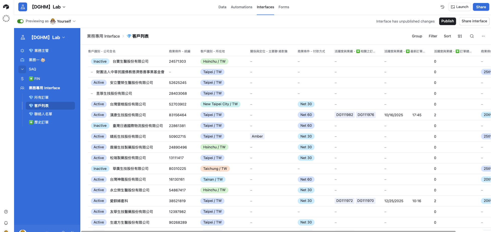

# 會議記錄

**主題：** 業務用 Interface 討論

---

## 一、基本資訊

- **會議時間：** 2026-01-03（週六）08:30–11:00
- **會議地點：** 視訊會議（Google Meet）
- **與會人員：** Cody, Aries

---

## 二、背景說明

跟據 Line 對話內容提及：

## 三、討論重點摘要

指出業務人員 (Chris) 提到年度規畫時會需要的資料，其中包含以下：

1. Sales Result

   - 業務單位需要以過往的歷史資訊來進行新一年度或季度業績的預估及策略調整
   - 利潤的計算作法
   - 單一客戶每季貢獻的業績成果

2. Customer Name

   - 字面理解上應是指 CRM 中的 Partners 與 ATTNs 表單中資料為主

3. Margin

   - 要計算單筆訂單或是某客戶在某區間內的訂單利潤，此功能可於 FIN 的 Profit & Cost Summary 中概略估算

4. Quotation Sheet

   - 理解上看上去應該是 CRM 中的 Quotation 列表，最多的情況會是每一單中它印出 Quotation 的 PDF 檔作為附件記錄

5. Currency

   - 因應不同國家訂單使用的匯率會影響單筆訂單的利潤及利潤率

延伸討論：
在原 FIN 資料庫有 Profit & Cost Summary 表單可以粗略估算該票利潤及利潤率，但目前沒有 Agent 的相關訂單，待之後有資料時再行討論如何應用。

---

## 四、其他討論

| 項次 | 內容                   | 提問 | 說明                                                                                                                                                                                                            | 評估                                                                                                                                                             |
| ---- | ---------------------- | ---- | --------------------------------------------------------------------------------------------------------------------------------------------------------------------------------------------------------------- | ---------------------------------------------------------------------------------------------------------------------------------------------------------------- |
| 1    | 業務角色 Interface     | Cody | 因為需要有進行業績的追縱及過往歷史記錄的對照參考，此業務角色它可能需要看到的內容不僅有 CRM，同時還可能包含 FIN 資料庫相關的數字內容，好讓規劃工作可以有參考資訊來作方向研擬                                     | 基本資料呈現用的 Interface 功能可以直接使用，但若需要有歷史資料來進行今年度的規劃及前膽分析，需在 FIN 中有歷史數據才能進行分析，相關需要的資料表單及內容可再討論 |
| 2    | Tracking 的 Automation | Cody | Ray 有提問：是否我們在資料庫 OMS > Tracking 中的 In Transit 中欄位中有更新時，系統就可以發送通知給相關單位(Import/Domestic：發給 Consignee，Export：發給 Agent)，但希望發件的 Email 網域能是 tailormed-intl.com | 可行，但需靠第三方軟體協力共同完成此自動化排程，原生 Airtable 無提供類似機制                                                                                     |
| 3    | SoA 後續               | Cody | 本次的功能可以不需說明文件，專為品牌設計的列印樣版也暫時不需要                                                                                                                                                  | 因上回 Demo 時有提說能否另外加上自動配對的功能，故上版 PO 會再調整項目內容與金額再寄出予以確認                                                                   |

---

## 六、待辦事項（Action Items）

- [ ] 第二版 SoA PO(Purchase Order)
- [ ] 業務用 Interface 概略功能草稿
- [ ] 第三方 Automation 研究及可能性調查

---

## 八、其他

### 1.歷史 Debit Notes

會議中有討論關於過往 TailorMed 歷史資料的登錄問題，因為新進的業務需要有過往的資料來去計劃未來業績成長的可能，但這次資料庫的啟用時間為近期 (2025/12/05)，固都沒有相關的內容可以進行推估。
提供建議是在 FIN 新建立一份只要簡單記載過往資料的表單，填具文件上的收入及成本支出，就能計算出該票的利潤及利潤率，好供給業務進行今年(2026)年的年度業務規劃參考。

### 2.業務用 Interface(前期)

綜合多方的考量，期望當前 Airtable 的資料庫權 Editor 限僅限於以下帳號操作：

- op@tailormed-intl.com
- fin@tailormed-int.com
- ray@tailormed-intl.com

新進業務 (Chris) 以及後續有可能新進之人員若要檢視相關資料庫的資料，擬使用 Interface 的 List 呈現，並限定其可以操作之範圍以及可檢視之欄位內容，以確保部內資料安全。
業務用介面 Screenshot 參考：

### 3.各項工作的 Priority 事宜

目前提及有需要優化或開發的工作項包含以下：

1. 帳務流程優化與 SoA 操作 Interface
2. 業務主管及業務人員專用之 Interface
3. 供應商稽核 (SAQ) 文件數位化
4. Tracking 狀態自動郵件寄發通知系統
5. 外務人員工作分派日曆檢視 Interface

目前就以 SoA 為確定要進行之項目，其他請再崴宇內部評估進行與否或是調整其優先次序。

---

**最後更新：** 2026-01-05  
**文件版本：** v1.0  
**文件負責人：** Aries
