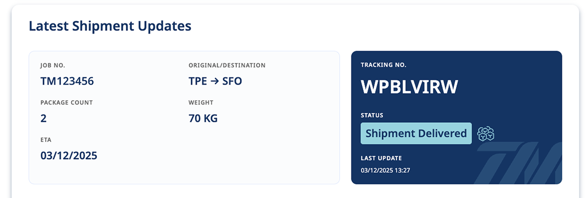

# 手冊

本系統為 TailorMed 提供之專屬查詢平台，協助客戶即時追蹤貨件運輸與溫控資訊。使用者僅需輸入「Job No.」與「Tracking No.」，即可查詢對應的運輸狀態與溫度紀錄。

本手冊將說明操作方式與查詢結果的各項定義，並提供後台設定指引與常見問題解答。

---

## 1. 系統簡介

- 平台網址：https://tracking.tailormed-intl.com/
- 功能目的：提供客戶與合作夥伴即時查詢冷鏈貨件的狀態與相關資訊。
- 資料來源：由【TailorMed】OMS 資料庫系統同步更新。

## 2. 登入與基本操作

- 本系統不需登入，開啟網址後即可使用。
- 查詢欄位：
  - 單號（Job No.）
  - 查詢碼（Tracking No.）

## 3. 查詢流程說明

1. 輸入貨件單號與查詢碼。
2. 點擊「STATUS CHECK」按鈕。
3. 系統顯示貨件基本資訊以及當前之運輸狀態。

## 4. 查詢結果解釋

查詢完成後，頁面將顯示以下四個主要區塊：

---

### （1）查詢欄位與狀態區（Tracking Lookup & Status）

位於頁面上方區塊，供使用者輸入查詢條件與顯示最新狀態資訊：

- Job No.：貨件單號（輸入欄位）
- Tracking No.：查詢碼（輸入欄位）

查詢結果如下圖：

- Job No.：貨件單號，顯示於左側卡片欄位。
- Original / Destination：起訖機場資訊，顯示為 IATA 三碼與箭頭標示（如 TPE → SFO）。
- Package Count：件數資訊。
- Weight：貨件重量。
- ETA：預估到達日期（Estimated Time of Arrival）。
- Tracking No.：查詢碼，顯示於右側深藍區塊。
- Status：目前狀態，依據資料庫即時更新（如：Shipment Delivered）。
- Status Icon：依據狀態顯示圖示（如：已送達顯示禮盒符號）。
- Last Update：系統顯示之最新狀態時間戳記。
- STATUS CHECK：查詢按鈕，輸入 Job No. 與 Tracking No. 後按下即可查詢。
- Support Info：若查無資料，會顯示聯絡資訊協助處理。

---

### （2）運輸進度時間軸（Shipment History Timeline）

位於畫面中央，呈現完整的運輸歷程，各節點包含時間戳記：

- Order Created
- Shipment Collected
- Origin Customs Process
- In Transit
- Destination Customs Process
- Out for Delivery
- Shipment Delivered

若貨件有補充乾冰紀錄，將顯示：

- Dry Ice Refilled (Terminal)
- Dry Ice Refilled

> **備註：節點顯示依據運輸類型略有不同**
>
> - 若資料庫中「Transport Type」為 `Domestic`，系統僅顯示以下節點：
>   - Order Created
>   - Shipment Collected
>   - In Transit
>   - Shipment Delivered
> - `Dry Ice Refilled` 與 `Dry Ice Refilled (Terminal)` 兩節點僅出現在「Transport Type」為 `Export`、`Import` 或 `Cross` 類型的國際型貨件，且視實際補充記錄是否存在而顯示。

---

### （3）狀態圖例區（Legend Area）

位於畫面底部，提供所有圖示狀態的對照說明：

- Executed：已執行
- On the Road：運送途中
- In Transit：轉運中
- Pending：尚未執行
- Task Completed：任務完成
- Shipment Delivered：已送達
- TBD：待確認（To Be Determined）
- Dry Ice Refilled：乾冰補充

---

### （4）使用回饋與滿意度調查區（Feedback Section）

此區塊位於查詢結果與狀態圖例（Legend）下方，於貨件查詢完成後顯示，目的為蒐集使用者對 Tracking System 的實際使用體驗與 TailorMed 崴宇國際物流所提供之服務回饋。

- 本區顯示感謝訊息，提醒使用者 Tracking System 已完成本次查詢服務
- 提供「Share Your Feedback」按鈕，連結至線上滿意度回饋表單
- 使用者完成表單並正確填寫相關資訊後，可依活動規則獲得指定回饋（如折扣券）
- 回饋內容將作為系統優化、流程改善與服務品質調整之參考依據

此區塊屬於**非必要查詢流程**的一部分，不影響貨件狀態顯示與資料查詢功能。

- 此區塊僅於貨件狀態為「Shipment Delivered」時顯示，其他狀態下將隱藏不顯示。
- 系統自動判斷是否顯示，不需使用者進行額外操作。

---

### （5）合作推廣與廣告預留區（Promotion / Advertisement Area）

本區塊為預留之視覺展示區域，設計目的在於支援未來業務推廣與合作需求，預設情況下顯示為示意 Banner。

- 可用於展示合作廠商、物流相關服務或指定推廣內容
- 內容可依不同客戶、專案或合作情境進行調整
- 實際顯示之圖片、連結與文案，將由管理端依業務需求進行設定
- 不影響查詢功能與系統效能，屬於獨立展示模組

此區塊目前作為版位與版型預留，未啟用時僅作為示意用途。

---

其餘查詢流程與查無資料的錯誤處理方式，請參見下方說明。

## 5. 系統後台設定（僅限內部操作）

- 新增貨件：透過 【TailorMed】OMS 資料庫 之 Tracking 表單建立新資料列。
- Tracking No. 產生：系統自動生成。

---

### Tracking 資料建立與填寫說明（Airtable 操作步驟）

建立 Tracking 資料列時，請依照以下步驟操作：

1. **新增貨件資料列**
   - 點選畫面下方 `+` 鈕新增列（如圖示【Step 1】）。
   - 輸入該筆貨件之 **Order No.**，並連結對應的 **AIRWAYBILL/POD**。
   - 系統將依照規則自動產生不重複的 **Tracking No.**。

   

2. **資料自動帶入與關聯欄位填寫**
   - 一旦 Order 與 AIRWAYBILL/POD 成功連結，**Ref. No.**、**Transport Type**、**Origin/Destination** 將自動帶入，無須手動填寫（如圖示【Step 2】）。

   

3. **運輸節點時間填寫**
   - 依實際狀況填寫各節點時間欄位，如：ETA、Shipment Collected、In Transit、Shipment Delivered 等。
   - 這些欄位將影響前台查詢結果與時間軸顯示。

4. **Dry Ice Refilled 與節點條件**
   - 若該貨件之 Transport Type 為 `Export`、`Import` 或 `Cross`，且實際發生乾冰補充事件，請勾選 `Dry Ice Refilled` / `Dry Ice Refilled (Terminal)` 欄位。
   - 若為 `Domestic` 類型，則系統前台將不顯示該兩節點，即使有勾選也不會顯示。

---

## 6. 常見問題與錯誤處理

- 查無資料：請確認輸入內容(Job No. 或是 Tracking No.)是否正確。
- 手機操作支援：支援行動版查詢。
